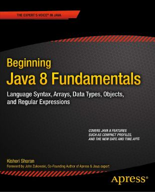
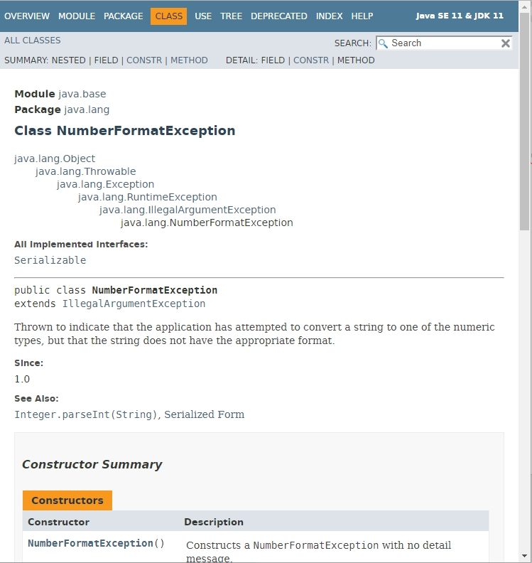
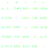
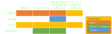

# JAVA Advanced (31089/1607/1819/1/72)
## Java Recap
### Overzicht

In Java Advanced worden geavanceerde topics geïntroduceerd. Deze Java Recap dient in de eerste plaats om kort een aantal basishandelingen in Java op te frissen. De meeste ideeën in dit onderdeel kan je terug vinden in het boek: *Beginning Java 8 Fundamentals* van (2014) van Kishori Sharan<sup>1</sup>.



Dit boek is voor AP studenten gratis downloadbaar via UA bibliotheken. Op https://start.ap.be/ kies je voor *Bibliotheek en databanken* en daarna voor *Catalogus en online diensten* waar je zoekt op `Sharan Java`. Je merkt dat dit boek een eerste van een trilogie is met als ander titels *Beginning Java 8 Language Features* en *Java 8 APIs, Extensions and Libraries*. Deze boeken zijn eveneens gratis downloadbaar en komen in andere colleges nog aan bod. De drie boeken uit de trilogie kan je downloaden door op de webpagina met de zoekresultaten van de catalogus telkens op het boek te klikken en dan de link te klikken naast *E-Info*. Je komt dan op een webpagina van SpringerLink terecht waar je het boek in zijn geheel of hoofdstuk-per-hoofdstuk kan downloaden in 2 verschillende formaten. De broncode kan je van [github](https://github.com/apress/beg-java-8-fundamentals) downloaden.

Merk op dat dit boek over Java 8 handelt en niet over de huidige LTS (Long term support) release van Java. Hoewel het dus in zekere zin een beetje verouderd is, heeft dit boek heel wat andere voordelen die hiervoor ruimschoots compenseren. Het voornaamste van deze voordelen is de heldere schrijfwijze waarmee de auteur ondubbelzinnig alle mogelijke vragen meteen weet te beantwoorden en geen voorkennis vereist. De volgende paragraaf illustreert de specifieke schrijfwijze:

<center style="width:60%;margin:auto;">"There are three types of operators based on the number of operands. An operator is called a unary, binary, or ternary operator based on the number of operands. If an operator takes one operand, it [is] called a unary operator; if it takes two operands, it [is] called a binary operator; if it takes three operands, it [is] called a ternary operator." — Sharan 2014, p. 98</center>

Sommigen zullen hier misschien een 'Jip en Janneke'-schrijfstijl in herkennen. Het maakt in ieder geval dat de auteur erin slaagt om een logische opbouw van de tekst te presenteren. 

### Hulpbronnen

Je hebt uiteraard het internet ter beschikking als je met bepaalde vragen zit. Daar kan je allerhande fora raadplegen op zoek naar iemand die een gelijkaardige vraag wist te beantwoorden. Toch is dat niet voldoende. Wil je je als Java ontwikkelaar respecteren, dan moet je echter ook goed je weg kunnen vinden in de officiële documentatie. Voor versie JDK11 kan je terecht op de [documentatie van Oracle](https://docs.oracle.com/en/java/javase/11/docs/api/index.html). Nog een goede raad. Je zal heel wat waarschuwingen en foutboodschappen te zien krijgen zoals de `NumberFormatException` of de `NullPointerException`, voornamelijk gegenereerd door `javac.exe`. Probeer elke nieuwe fout die je tegenkomt op te zoeken.



### Codeerstijl

Nog even de basis codeerstijl te overlopen (rest volgt later misschien nog):

```java
public MyClass{
	private int myVariable;
	private final int MY_CONSTANT = 0;

	public myMethod ( int myVariable ){
		this.myVariable = myVariable;
	}
}
```

### Java programma

Een Java toepassing bestaat uit een aantal klasse bestanden (bestanden met extensie `.java`) met per bestand telkens één type. Hieronder worden de drie optionele onderdelen van een Java klasse bestand nog eens overlopen.

```java
// Package declaration
package be.ap.javadv.recap;

// Import declaration
import java.lang.System;

// Type declaration
public class ProgramParts {
	public static void main(String[] args) {
		System.out.println("Hello World!");
	}
}
```

Er is maximaal één pakket declaratie en de onderdelen van de pakketnaam komen overeen met de folder structuur op schijf. Denk eraan dat de pakketnaam met uitsluitend kleine letters geschreven moet zijn. Indien deze declaratie wordt weggelaten wordt het standaard pakket ('default package') verondersteld. Net als voor de pakket declaratie, kan er maximaal één type gedeclareerd worden per klasse bestand. In tegenstelling tot deze declaraties, kunnen er meerdere import declaraties zijn, uiteraard.

> Oef Recap.1 [20 min]: In jouw VS Code IDE maak je een nieuwe Java toepassing aan met de opdracht `Java: Create Java Project`. Doe dit door op F1 of `ctrl + shift + P` te drukken en deze opdrachtnaam op te geven. Tijdens het typen verschijnt er een keuzelijst met de opdracht. Gebeurt dit niet dan ontbreekt er misschien een VS Code extensie, kijk opnieuw de installatie na. Van het nieuwe project verwijder je de standaard package `app` in de `src` folder en maak je een nieuwe folder structuur aan die de bovenstaande pakketnaam volgt.

> Typ nu het bovenstaande programma manueel over in jouw VS Code IDE (zo krijg je snel weer Java in de vingers) en bewaar het bestand. Ga nu kijken naar de `bin` folder. Als alles juist geïnstalleerd is zie dat VS Code de compilatie van broncode naar bytecode volautomatisch heeft uitgevoerd. Nu kan je de main methode uitvoeren en in de console verwacht je de zin `Hello world!` te zien verschijnen. Je kan de console/terminal/foutberichtvenster tonen en verbergen met de toets combinatie `ctrl + ù`.


Je zou moeten weten dat het compileren van een `.java` bestand naar een `.class` bestand door `javac.exe` gebeurt en architectuur-onafhankelijk is. Het `.class` bestand bevat de zogenaamde *bytecode* en je kan deze zichtbaar maken door een decompiler te gebruiken (zie bijvoorbeeld de VS Code extentie `dgileadi.java-decompiler` of gebruik de met Java meegeleverde `jad.exe`).

> Oef Recap.2 [20 min]: Tracht zelf eens jouw net aangemaakte `.class` bestand te decompileren. Gebruik hiervoor `jad.exe` en werk vanuit het terminal paneel binnen VS Code. Voer eerst eens gewoon `jad` op gebruik desnoods het volledige pad als dat niet lukt (`jad.exe` staat in de `bin` subfolder van jouw Java installatie folder). Je ziet dan de verscheidene parameters, lees de info en probeer er eens een paar uit.

De tweede stap is het uitvoeren van de het `class`-bestand (niet te verwarren met het *klasse bestand* of *class file* dat hierboven reeds genoemd werd) door `java.exe`, de OS-afhankelijke software-matige implementatie van de JVM (*Java Virtual Machine*) die met jouw machine overeenkomt (je hebt inderdaad ook hardware-matige implementatie van de abstract JVM specificaties). Technisch gezien kan men zeggen dat de JVM een combinatie vormt van een stack machine, een register machine en een uitvoerings machine (*execution machine*). De JVM en de de Java API (Application Programming Interface) vormen samen het *Java platform* of *Java runtime system*.

### Stack versus heap

De stack volgt de uitvoering van methodes op. Het weet op welke lijn de JVM zich bevindt en weet wat de huidige staat (*state*) is van een methode inclusief de formele parameters. Omdat de ene methode de andere kan oproepen bewaard de stack alles in zogenaamde frames (*stack frames*). De heap is het speelveld van de *garbage collector* (GC, men spreekt van de *garbage-collectible heap*) en bevat alle objecten waar vanuit de stack, door middel van referentie variabelen, verwezen kan worden.

### Java sleutelwoorden

De volgende sleutelwoorden zijn gereserveerd en mogen niet als variabele naam (*identifiers*) gebruikt worden:

```
 abstract  continue  for         new        switch       
 assert    default   goto        package    synchronized 
 boolean   do        if          private    this         
 break     double    implements  protected  throw        
 byte      else      import      public     throws       
 case      enum      instanceof  return     transient    
 catch     extends   int         short      try          
 char      final     interface   static     void         
 class     finally   long        strictfp   volatile     
 const     float     native      super      while        
 true      false     null
```

> Oef Recap.3 [10 min]: Bekijk de lijst van bovenstaande sleutelwoorden aandachtig. Probeer zelf eens een variabele te declareren met een van deze sleutelwoorden en bekijk de CT fout die daarop volgt. Onthou de fout en de oorzaak zodat je de volgende keer dat je deze fout tegenkomt (bijvoorbeeld op het examen) weet wat je te doen staat.

Merk op dat de laatste drie niet echte sleutelwoorden zijn in de strikte betekenis van het woord. Zo is `null` een waarde (*litteral value*) van het `null` referentie type net zoals `3` een waarde van het `int` primitief type is.

### Java Operatoren

Hier is een korte lijst om de minder voordehand liggende even operatoren terug op te frissen:

| Operator | Description               | Voorbeeld                       |
|----------|---------------------------|---------------------------------|
| `/`      | Deling                    | `5/2` => 2; `5.0/2.0` => 2.5    |
| `%`      | Modulo                    | `5 % 3` => 2                    |
| `++`     | Incrementeren             | `1+`                            |
| `-=`     | Aftrekken en toekennen    | `num=10`;`num-=5` => `num=5`    |
| `%=`     | Rest en toekennen         | `num=5`;`num%= 5` => `num=2`    |
| `A?B:C`  | Als A dan B anders C      | `x= y==null ? Z : Y`            |
| `==`     | Gelijkheid                | `y == 2`                        |
| `!=`     | Ongelijkheid              | `a!=r`                          |
| `&`      | Logische EN               | `IsValid & t<5 ? "OK" : "NOK"`  |
| `|`      | Logische OF               | `NotValid | t>5 ? "NOK" : "OK"` |
| `&&`     | Logische EN (korte keten) | `if ( x != null && x > 5)`      |
| `||`     | Logische OF (korte keten) | `if ( x==null || x.isEmpty())`  |
| `^`      | Logische XOR              | `true ^ true` => false          |

### Control Flow

Hieronder wordt nog eens de verschillende programma constructies op een rijtje gezet.

#### If-then-else

```java
if ( conditie1 ){
	// Actie onder conditie 1
} else if ( conditie2 ){
	// Actie onder conditie 2
} else {
	// Actie buiten condities 1 en 2
}
```

#### Switch

```java
switch ( expressie ){
	case waarde1:
		// Acties bij waarde 1, gescheiden door puntkomma's
	case waarde2:
		// Acties bij waarde 2, gescheiden door puntkomma's
	case waarde3:
		// Acties bij waarde 3, gescheiden door puntkomma's
	default:
		// Acties bij waarden verschillend van 1, 2 en 3
}
```

#### For-lus

```java
for ( /* Initialisatie */; /* Conditie */; /* Delta */){
	// Acties die herhaald moeten worden
}
```

Waarbij de *initialisatie* optioneel is of één of meerdere tellers kan initialiseren, zij het van hetzelfde type (e.g. `int i = 0, j = 10` of `double r = 0.0F`). De conditie is ook optioneel en wordt bij het weglaten impliciet op `true` gezet, d.w.z. een oneindige lus. Indien niet leeg, moet de conditie expressie uiteraard de waarde `true`of `false` teruggeven. De delta dient om de tellers aan te passen. Het is ook optioneel maar kan ook een lijst van komma-gescheiden expressies bevatten. Typische voorbeelden zijn `i++` of `i--, j=j%2`. Veel complexere voorbeelden zijn mogelijk maar het is beter de logica zoveel mogelijk in de code block `{}` na de `for()` statement te bewaren, zeker indien het niet gaat om het manipuleren van de tellers. 

#### For-each

Omdat de traditionele `for` niet helemaal het OO (objectgeoriënteerd) paradigma hanteert, is een `for each` constructie vaak veel interessanter.

```java
for ( /* Element */ : /* Collectie, lijst of array*/ ){
	// Afhandeling Element
}
```

#### While lus

```java
while ( /* condities met of zonder teller afhandeling */){
	// Herhaling handelt zelf het einde van de lus af d.m.v
	// break of continue
}
```

De conditie expressie onmiddellijk achter het `while` sleutelwoord moet een boolean teruggeven. Het kan gewoon `true` zijn voor een oneindige lus, een eenvoudige conditie zoals `i<10` of een expressie waarin ook de teller wordt afgehandeld zoals in `++i <= 10` waardoor de teller afhandeling niet in de code blok `{}` moet worden opgenomen.

Indien de `while ()` wordt voorafgegaan door `do {}`, dan wordt de code blok `{}` eerst uitgevoerd alvorens de conditie-expressie voor de eerste maal uit te voeren. Let erop dat een `do-while` statement altijd met een puntkomma wordt afgesloten.

```java
do {
	// Te herhalen code
}
while ( /* condities met of zonder teller afhandeling */);
```

#### Break and continue

Om de uitvoering van een code blok op een bepaad punt te verlaten, meestal onder bepaalde voorwaarden, kan men gebruikt maken van een `break;` statement. De executie van de code gaat dan voort in de omvattende code blok. In hiërarchisch geneste code blokken kan men d.m.v. `break` dus slechts één niveau hoger springen. Wil je twee of meer niveaus hoger springen of ergens helemaal anders naartoe springen gebruik je een *labeled break statement*:

```java
outer:
for ( int i = 1;; i++ ){
	for ( int j = 1;; j++ ){
		if ( i == j ){
			break outer;
		}
	}
}
```

Binnen `while`, `do while` en `for` constructies kan een `continue;` statement ervoor zorgen dat de executie wordt over gedragen naar de conditie-expressie of delta-expressie al naargelang de situatie.

> Oef Recap.3 [30 min]: Gebruik de bovenstaande constructies om rechtstreeks vanuit een main methode de onderstaande correlatiematrix in de console af te drukken (niet de lijntjes, enkel de kolom en rij hoofdingen en de inhoud van de matrix). Vertrek vanuit een twee-dimensionale array van het gepaste type. Druk eerste de matrix volledig af en druk daarna de onderste halve matrix af (enkel de waarden *onder* de diagonaal). Maak een versie die gebruik maakt van een gewone `for`-lus en eentje die van een `for each` gebruik maakt. Werk met arrays.



> Oef Recap.4 [30 min]: Maak een `ChessBoard` klasse aan dat een schaakbord-patroon aanmaakt en afdrukt. De klasse heeft een constructor die een parameter `size` aanvaardt. Deze parameter bepaalt de grootte van het 'schaakbord'. Maak dan de methode `createBoard` die een twee-dimensionale array aanmaakt en bewaart in een objectvariabele `board`. Een tweede methode (`print`) drukt het schaakbord af gebruik makende van de characters `■` (code = `0x25A0`) en `□` (code = `0x25A1`) en van de opdracht `out.printf ( "%c ", /*code hier*/ )`. Een voorbeeld (`size=4`) staat hieronder:

```
□ ■ □ ■
■ □ ■ □
□ ■ □ ■
■ □ ■ □
```

### Klassen en types

Klassen staan uiteraard centraal in OO programmeren. Ze brengen de verscheidene objecten samen die een zekere graad van verwantshap hebben. Het zijn sjablonen of blauwdrukken voor het aanmaken van objecten. Bovendien worden in java alle instructies ingepakt in klassen, elk in hun eigen klasse-bestand:

```java
package be.ap.javadv.recap;

<modifiers> class <KlasseNaam> <klasse relaties>{
	// Variabele
	<modifiers> <data type> <veldnaam> = <initiële waarde>;

	// Methode
	<modifiers> <type> <naam> (<paramelijst>) <throws> {
		// Code hier
		return <return value>;
	}
}
```

Tot de body van een klasse behoren velden (*fields*), methoden (*methods*), *constructors* en *static* en *instance initializers*. De velden en methoden worden de leden (*members*) van de klasse genoemd. Een objectveld (*instance field*) is gebonden aan de objecten terwijl een klasseveld (*class field*) geassocieerd is met de klasse zelf en gekenmerkt wordt door het gebruik van de sleutelwoord `static`.

Het declareren van een klasse komt neer op het definiëren van een nieuw referentie type (*reference type*). Naast de bestaande primitieve types (`byte`, `short`, `int`, `long`, `float`, `double`, `char`, `boolean`) en andere referentie types, maak je dus een nieuw variabele type aan dit binnen de namespace of na het gebruik van een `ìmport` statement ook aangewend kan worden.

Hieronder vind je een eenvoudig voorbeeld van het declareren en gebruik van een klasse (Listing 6-2 op p. 172):

```java
package be.ap.javadv.recap;

public class Human {
	public static int count;

	public String name;
	public String gender;
}

class HumanTest {
	public static void main(String[] args) {
		// Increase count by one
		Human.count++;

		// Create an instance of Human class
		Human jack = new Human();

		// Assign values to name and gender
		jack.name = "Jack Parker";
		jack.gender = "Male";

		// Read and print the values of name, gender and count
		String jackName = jack.name;
		String jackGender = jack.gender;
		long population = Human.count;

		System.out.println("Name: " + jackName);
		System.out.println("Gender: " + jackGender);
		System.out.println("Population: " + population);

		// Change the name
		jack.name = "Jackie Parker";
		
		// Read and print the changed name
		String changedName = jack.name;
		System.out.println("Changed Name: " + changedName);
	}
}
```

Behalve klassen bestaan er nog twee andere types: enumeraties en interfaces. Er zijn ook annotaties, maar die kunnen beschouwd worden als een speciaal soort interface.

### Toegankelijkheidsniveaus

In java bestaan er de volgende toegankelijkheidsniveaus:

- Standaard toegankelijkheid (indien niet opgegeven; =*package-level*): toegankelijkheid varieert al naargelang het programma element
- `private`: toegankelijk binnen de klasse
- `public`: toegankelijk buiten het pakket
- `protected`: toegankelijk binnen pakket en alle subklassen



Om effectief toegang te krijgen to de nodige types kan het natuurlijk zijn dat je een `import` statement moet invoegen. Denk er dan aan dat expliciete imports (*single-type imports*) altijd beter zijn en de voorkeur krijgt t.o.v. het gebruik van een filter mask als in `java.lang.*` (*on-demand imports*). Voor het importeren van statische variabelen of methoden van types kan je een statische import gebruiken (e.g. `import static java.lang.System.out;` en `import static java.lang.Math.*;`). 

Hier volgen nog een aantal opmerkingen omtrent toegankelijkheid. 
1. In OO geldt de vuistregel dat alle informatie die de status van een object bepalen privaat moet blijven voor die methode (encapsulation). Toegang tot private variabelen van een klasse gebeurt via publieke getters en setters. 
2. Bij het implementeren van helper methoden is het logisch om eerder de standaard toegankelijkheid (pakket niveau) te gebruiken. 
3. Private methodes dienen voor methodes die niet gebruikt worden buiten de klassen zoals bijvoorbeeld voor validatie.
4. Gebruik `this` respectievelijk de klassenaam prefix indien het  gevaar bestaat dat lokale variabelen via het principe van het zogenaamde *name hiding* een gelijknamig object (respectievelijk klasse) variabele onzichtbaar maakt. Denk eraan dat `this` verwijst naar het huidig object. Het kan dus niet in de context van een niet-geïnstantiëerde klasse gebruikt worden. In dit laatste geval  gebruik je dus de klassenaam prefix.

### Initialiseren

Het initialiseren van een nieuw aangemaakt object gebeurt typische door het gebruik van constructors. Hier volgt een voorbeeld:

```java
Dog myDog = new Dog("Blaffy", 2);
myDog.setID(Dog.generateIDs(1));
myDog.bark();
```

In dit voorbeeldje wordt een nieuw object van het type `Dog` aangemaakt en wordt het nieuw object meteen geïnitialiseerd door middel van de actuele parameters `"Blaffy"` en `2`. De niet-private objectmethode `setID` moet ervoor zorgen dat het object een of andere identificatiecode meekrijgt. Deze code wordt hier gegenereerd door middel van de klasse methode `generateIDs` (i.e. een methode die als `static` staat opgegeven). Tenslotte wordt nog de objectmethode `bark` uitgevoerd.

Wil men in het bovenstaand voorbeeldje ervoor zorgen dat een object van het type `Dog` kan aangemaakt worden zonder dat er actuele parameters worden meegegeven, dan kan dit via *constructor overloading*:

```java
package be.ap.javadv.recap;

public class DogTest {
	public static void main(String[] args) {
		Dog myDog = new Dog("Blaffy", 2);
		myDog.setID(Dog.generateIDs(1));
		myDog.bark();

		Dog yourDog = new Dog();
		yourDog.bark();
	}
}

public class Dog {
	private String name;
	private int age;
	private int id;

	public Dog() {
		this("Lassy", 20);
	}

	public Dog(String name, int age) {
		this.name = name;
		this.age = age;
	}

	public static int generateIDs (int n){
		//TODO: Refactor this method
		return 0;
	}

	public void bark() {
		System.out.println(name + " (" + id + ") is " +
			age + " and says Hatchie!");
	}

	public void setID(int id) {
		this.id = id;
	}
}
```

Denk eraan dat constante waarden net als een variabele worden gedeclareerd maar dat je het sleutelwoord `final` moet toevoegen.

```java
final double TAU = 2 * Math.PI;
final Human me = new Human("Chad");
```

Je kan ook gebruik maken van static initializers:

```java
public class MyMath {
	public static final double SEED;

	static {
		SEED = Math.random ();
	}
}
```

### Parameters

Een methode creëren betekent nadenken over de inputs en outputs van de methode. Inputs worden meegegeven door middel van parameters, outputs moeten via een `return` statement worden teruggegeven.

```java
public int sum (int a, int b){
	return a + b;
}
```

In dit voorbeeldje zijn `a` en `b` formele parameters (*formal parameters*). De term 'formeel' onderscheidt deze van de waarden die meegegeven worden bij het aanroepen van de methode, de actuele parameters (*actual parameters*). Bijvoorbeeld in `sum(t, 13)` zijn `t` en `13` actuele parameters. Gebruik het sleutelwoord `final` om aan te geven dat een formele parameter in de bijhorende methode niet mag gewijzigd worden (dit wordt dan bijvoorbeeld `final int a` in bovenstaand voorbeeld).

> Oef Recap.3 [45 min]: Denk aan jouw lievelings 'object' in de echte wereld, iets uit je eigen interesseveld, en vertaal dit naar een Java klasse. Voorbeelden kunnen zijn *Jetski*, *Dromedaris*, *SmartPhone*, *E-boek*. Denk na over wat voor methodes de klassen allemaal zou kunnen hebben. Probeer hieruit 2 methodes te kiezen die je `private` zou zetten en twee die `public` zou zetten. Zoek nu ook telkens twee object- en klasse variabelen die bij de klasse zouden kunnen horen. Implementeer de klasse en schrijf er een testklasse voor (`public class <klassenaam>Test`) met daarin een uitvoerbare methode die alle publieke methode uittest. Zorg dat elke methode iets naar de console wegschrijft.

### Overerving

Overerven (*extending*, *subclassing*) doe je door het `extends` sleutelwoord te gebruiken. Dit gaat enkel als de bedoelde superklasse (*super class*) niet als `final` staat gemarkeerd. Alle klassen in Java erven stilzwijgend over van de `Object` klasse. Sommige methoden van de `Object`klasse staan gemarkeerd als `final`, dat betekent dat deze niet overschreven (*overridden*) kunnen worden in de subklasse (*subclass*). Hier volgen de methode van de `Object` klasse nog eens op een rij (Tabel 7-1 op p. 283):

| Methode                              | Abstract | Aanpasbaar | Omschrijving                                                    |
|--------------------------------------|----------|------------|-----------------------------------------------------------------|
| public String toString()             | Neen     | Ja         | Geeft tekstvorm weer van het object.                            |
| public boolean equals(Object obj)    | Neen     | Ja         | Vergelijkt gelijkwaardigheid met ander object.                  |
| public int hashCode()                | Neen     | Ja         | Geeft hash code terug.                                          |
| protected Object clone()             | Ja       | Ja         | Maakt een kopij van object aan.                                 |
| protected void finalize()            | Ja       | Ja         | Methode die wordt aangeroepen net voordat de GC het vernietigd. |
| public final Class getClass()        | Neen     | Neen       | Geeft referentie naar klasse terug.                             |
| public final void notify/notifyAll() | Neen     | Neen       | Notificeert de/alle thread(s) in de wachtrij van het object.    |
| public final void wait()             | Neen     | Neen       | Laat de thread wachten.                                         |

> Voeg aan jouw lievelingsklasse dat je hierboven maakte een `toString` methode toe die de gelijknamige methode van de `Object` klasse overschrijft en voeg toe aan de bijhorende testklasse (i.e. `System.out.print ( mijnObject );`).

### Object-georiënteerd programmeren

Het OO paradigma is ooit in het leven geroepen om programma's efficient onderhoudbaar te maken. Het plaatst het object centraal (ten opzichte van de acties centraal te zetten). Het omvat de principes van encapsulatie, overerving, polymorfisme en abstractie.

Het is hier niet de plaats om OO (opnieuw) volledig uit de doeken te doen. De bedoeling om OO hier op te brengen is om te benadrukken dat OO een paradigma maar niet een vaste regel maar je halsstarrig aan moet proberen vast te klampen. OO mag nooit een doel op zich worden en dat geldt trouwens voor alle paradigma's. Gelukkig weten de meeste ontwikkelaars dit zeer goed. Ook in Java bestaan er erg veel structuren (zoals statics) die in feite de principes van OO tegenwerken. Bijvoorbeeld de Math klasse is alles behalve OO, net omdat hier de mathematische functies centraal staan en er abstractie van objecten wordt gemaakt. Een ander voorbeeld zijn het formatteren van tekst en datum variabelen zoals in `"p-value = %.4f"`. Uiteindelijk wordt de bytecode door JVM omgezet naar machine code en die is uiteraard ook alles behalve OO.

Tot hier het recapituleren van basis Java. We gaan nu meer geavanceerde topics aansnijden. Af en toe zullen we nog terug keren op onze stappen en even de basisch nog eens oprakelen. Dus, don't panic.

### Termen

| Term | Betekenis            |
|------|----------------------|
| CT   | Compile-time         |
| GC   | Garbage Collector    |
| JVM  | Java Virtual Machine |
| OO   | Object georiënteerd  |

### Referenties

||Literatuur|
|-|-|
|<sup>1</sup>|Sharan K (2014) Beginning Java 8 Fundamentals: Language Syntax, Arrays, Data Types, Objects, and Regular Expressions. Apress. ISBN: 978-1-4302-6653-2.|
|<sup>2</sup>|Sharan K (2014) Beginning Java 8 Language Features: Lambda Expressions, Inner Classes, Threads, I/O, Collections, and Streams. Apress. ISBN: 978-1-4302-6659-4.|
|<sup>3</sup>|Sharan K (2014) Beginning Java 8 APIs, Extensions and Libraries: Swing, JavaFX, JavaScript, JDBC and Network Programming APIs. Apress. ISBN: 978-1-4302-6662-4.|
