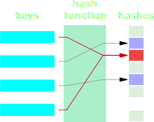

# JAVA Advanced (31089/1607/1819/1/72)
## Collections
### Inleiding

Dit onderdeel handelt over allerlei soorten collecties. Het is een cruciaal onderdeel om Java ook in de praktijk vlot te kunnen gebruiken. Alvorens we effectief collecties gaan bespreken, zullen een eerste aantal termen zoals hash codes en Wrapper classes bespreken.

### Hash Codes

Een hash code is een geheel getal dat als vereenvoudigde voorstelling moet dienen van een object. Op basis van een object, kan door middel van een hash functie de hash code berekend worden. Het dient om het efficient objecten te kunnen terugvinden in een grote collectie (*hash-based collection*) van zulke objecten, e.g. `HashTable`, `HashMap`. De hash code, kortweg hash, van elk object kan opgeroepen worden via de ingebouwde Java functie `hashCode` uit de `java.lang.Object` bibliotheek (oude implementatie voor Java < 7.0) of via de `Objects.hash` methode uit de `java.util` bibliotheek. Hieronder volgt er een voorbeeld stukje code. Het veronderstelt het bestaan van een klasse `Human` met een constructor die de naam en het geslacht verwacht.
 
```java
Human lisa = new Human ( "Lisa", "female" );
Human ahmed = new Human ( "Ahmed", "male" );

out.println ( "Are Lisa and Ahmed the same human?" );
out.println ( "The answer is " +
	((Objects.hash(lisa) != Objects.hash(ahmed)) ? "No." : "Maybe."));
```

> Oef Coll.1 [30 min]: In de Recap namespace, probeer de `hashCode` en `hash` methodes eens aan te roepen en kijk naar het resultaat. Probeer ook eens meerdere instanties van eenzelfde klasse te creëren, zoals hierboven, en vergelijk hun codes.

Vele programmeurs denken dat een hash code een unieke code is die een bepaald object voorstelt. Dat is dus niet waar. Kijk bijvoorbeeld naar deze figuur uit het engelstalig Wikipedia artikel voor *hash function*:



Merk op dat er twee verschillende namen de hash `02` hebben (rode pijlen). Daarom dat er in bovenstaande code "Maybe" stond. Indien de hashes van twee objecten verschillen, dan weet men zeker dat de objecten ook echt verschillend zijn. Indien de hashes hetzelfde zijn, kan men geen uitspraak doen. Bij de meeste hashed collections zal de kans erg klein zijn dat twee dezelfde hashes afkomstig zijn van verschillende objecten maar die kans hoeft niet per sé nul te zijn om een geldige hashed collection te zijn en hoe groot die kans precies is hangt af van de implementatie. De ingebouwde hash functies van Java zijn gebaseerd op de geheugenplaats van het object waarnaar verwezen wordt. De kans is dus in principe onbestaande dat twee dezelfde hashes afkomstig zijn van twee verschillende objecten.

Je kan zelf de `hashCode` methode overschrijven. Waarom zou je zoiets doen? Het probleem van ingebouwde hash code is dat ze beperkt zijn in hun gebruik. Door hashes te gebruiken kan je (soms) te weten komen of twee objecten verschillend zijn. Als de hashes van twee objecten verschillen weet je zeker dat de objecten verschillen. Maar wat betekent het eigenlijk om te verschillen? Kijk bijvoorbeeld naar deze code: 

```java
Human human1 = new Human ( "Lisa", "female" );
Human human2 = new Human ( "Lisa", "female" );

out.println ( "Are human1 and human2 the same human?" );
out.println ( "The answer is " +
	((Objects.hash(human1) != Objects.hash(human2)) ? "No." : "Maybe."));
```

Voor zover de klasse `Human` gedefinieerd is (door middel van naam en geslacht) lijken `human1` en `human2` hetzelfde object terwijl het resultaat van de bovenstaande code toch iets anders vertelt. Dat heeft natuurlijk te maken de ingebouwde hash functies die, tegen beter weten in, zich baseren op de geheugenplaats van het overeenkomstig object. Ook de standaard implementatie van de `equals` methode op de `Object` klasse baseert zich op de geheugenplaats waar de referentietypes (die zich als pointers gedragen) naar verwijzen (voor meer info rond zie Sharan (2014)<sup>1</sup> p.285.):

```java
// Vereenvoudigde weergave
public class Object{
	// […]
	public boolean equals(Object obj) {
		return (this == obj);
	}
	// […]
}
```

Het herimplementeren van zowel `equals` en `hashCode` gaan hand-in-hand gaan. We gaan zo meteen bespreken waarom dat zo is, eerst gaan we kijken hoe beiden methoden samen kunnen worden aangepast en op elkaar afgestemd. Dit is uitgewerkt in onderstaand voorbeeld afkomstig van listing 7-2 op p.291:

```java
package be.ap.javadv.collections;

public class SmartPoint {
	private int x;
	private int y;

	public SmartPoint(int x, int y) {
		this.x = x;
		this.y = y;
	}

	public boolean equals(Object otherObject) {
		// Zelfde geheugenplaats dan moet het wel zelfde punt zijn
		if (this == otherObject) {
			return true;
		}

		// Gaat het om een null referentie, dan moeten de punten wel
		//  verschillend zijn
		if (otherObject == null) {
			return false;
		}

		// Als het ander object geen punt is, kunnen ze onmogelijk gelijk zijn
		if (this.getClass() != otherObject.getClass()) {
			return false;
		}

		// Converteer naar punt
		SmartPoint otherPoint = (SmartPoint) otherObject;

		// Punten worden geacht gelijk te zijn indien de coördinaten
		//  hetzelfde zijn.
		boolean isSamePoint = (this.x == otherPoint.x && this.y == otherPoint.y);

		return isSamePoint;
	}

	public int hashCode() {
		// Geldige maar zeker niet uniek has code daar {3, 7} en {7, 3}
		//  eenzelfde has gaan vertonen.
		return (this.x + this.y);
	}
}

public class SmartPointTest {
	public static void main(String[] args) {
		SmartPoint pt1 = new SmartPoint(10, 10);
		SmartPoint pt2 = new SmartPoint(10, 10);
		SmartPoint pt3 = new SmartPoint(12, 19);
		SmartPoint pt4 = pt1;

		System.out.println("pt1 == pt1: " + (pt1 == pt1));
		System.out.println("pt1.equals(pt1): " + pt1.equals(pt1));

		System.out.println("pt1 == pt2: " + (pt1 == pt2));
		System.out.println("pt1.equals(pt2): " + pt1.equals(pt2));

		System.out.println("pt1 == pt3: " + (pt1 == pt3));
		System.out.println("pt1.equals(pt3): " + pt1.equals(pt3));

		System.out.println("pt1 == pt4: " + (pt1 == pt4));
		System.out.println("pt1.equals(pt4): " + pt1.equals(pt4));
	}
}
```

Merk op dat in dit voorbeeld dat `equals` en `hashCode` beiden gebaseerd zijn op zowel de `x` als de `y` coördinaat.

> Oef Coll.2 [10 min]: Hover in de VS Code editor eens over de hash en hashCode functies en lees wat er staat. Probeer de raad en voorbeeld die bij de hash functie staan op te volgen. 

Merk uit bovenstaand voorbeeld ook op dat `equals` en `hashCode` beantwoorden aan de volgende regel bij het vergelijken van twee objecten `A` en `B`, letterlijk overgenomen van <sup>1</sup> (met andere namen om verwarring te vermijden):

<center style="width:60%;margin:auto;">"If A.equals(B) returns true, A.hashCode() must return the same value as B.hashCode(). That is, if two objects are equal according to the equals() method, they must have the same hash code values returned from their hashCode() methods. However, the opposite may not be true. If two objects have the same hash codes, that does not imply that they must be equal according to the equals() method. That is, if A.hashCode() is equal to B.hashCode(), that does not imply that A.equals(B) will return true." — Sharan 2014<sup>1</sup>, p. 294</center>

Dat maakt dat beide methoden op elkaar zijn afgestemd. Merk ook op dat het algoritme voor het berekenen van de hash van een `SmartPoint` object geldig is omdat het aan de voorwaarden voldoet van een hash functie. Maar, zoals aangegeven in de commentaar, is het in de praktijk zeker niet aan te bevelen. Ten slotte nog één opmerking. In bovenstaand voorbeeld worden twee primitieve types (twee `int` variabelen `x` en `y`) gebruikt voor het vergelijken van objecten. Indien één of meerdere referentie types bij het vergelijken betrokken zou worden (bijvoorbeeld een type `CoordinateSystem`) dat zou (volgens de regels van OO) ook voor dat type zelf verantwoordelijk moeten zijn voor het herimplementeren van de `equals` en `hashCode` methoden en zou er vanuit de `SmartPoint.equals` methode `CoordinateSystem.equals` aangeroepen moeten worden (cascade principe). Zie verder op p.291-295<sup>1</sup> als er iets in bovenstaande code niet helemaal duidelijk is.

Waarom is het eigenlijk noodzakelijk om `equals` en `hashCode` samen te herimplementeren? Waarom is het belangrijk dat ze op elkaar zijn afgestemd? Dat heeft te maken met het feit dat beide methoden op vele ander plaatsen gebruikt worden, zonder dat de oorspronkelijke ontwikkelaar van de klasse er noodzakelijk zelf van bewust is. Indien bijvoorbeeld objecten van deze klassen in een hashed collection worden gestoken, zullen de `equals` en `hashCode` methoden automatisch aangeroepen worden. Indien dan beiden niet op elkaar zijn afgestemd kunnen er zich problemen voordoen die soms uiterst moeilijk te debuggen zijn. Bovenaan p. 294<sup>1</sup> worden nog eens de voorwaarden opgesomd om een correcte herimplementatie van `equals` te bekomen. Je hoeft dit niet van buiten te kennen, uiteraard, maar het is wel aan te raden leesvoer.

Nog één puntje dat misschien aan je is voorbijgegaan: doordat een hash een eenvoudige representatie is van een vaak veel complexer object kan deze als index dienen en laat het geïndexeerde zoekopdrachten en sorteringen toe. Een object van miljoenen bytes in omvang kan nu voorgesteld worden door een getal van 4 bytes!

Laten we nog even teruggrijpen naar het voorbeeld van Lisa en Ahmed. Wat als we willen weten precies hoe verschillend ze zijn? We kunnen een methode `float compare ( Person a, Person b )` schrijven dat twee personen vergelijkt en een getal tussen 0 en 1 retourneert waarbij 0 'totaal verschillend' betekent en 1 voor identieke tweelingen is weggelegd. Stel je voor dat deze berekening, indien gebaseerd op de afzonderlijke eigenschappen, nogal complex en traag is en dat zulke vergelijkingen dus best niet 'on-the-fly' berekend kunnen worden. Het tijdelijk opslaan van een matrix die alle vergelijkingen tussen alle personen bevat is praktisch niet haalbaar want neemt veel geheugen in beslag ($O(x^2)$) en vergt veel onderhoud bij het creëren of verwijderen van personen uit de databank. Het alternatief is het ontwerpen van een slimme 'hash' die verder gaat dan enkel een ja/neen antwoord te geven op de vraag of twee objecten verschillend zijn. Zulk een slimme hash laat toe om de afstand tussen twee personen te berekenen. Denk bijvoorbeeld aan de vergelijking met coördinaten van punten in een driedimensionaal assenstelsel. De coördinaten vertellen niet alleen of een punt zich op dezelfde plek bevindt als een ander punt, maar bevat ook informatie om heel snel de afstand tot dat ander punt te berekenen, namelijk via de volgende formule:

 $$d=\sqrt{\Delta x^2+\Delta y^2+\Delta z^2}$$

> Oef Coll.3 [120 min]: Maak een klasse `Point` dat voor de coördinaten de publieke object variabelen `x`, `y` en `z` definieert. Het bereik van de coördinaatwaarden (type `float`) is beperkt in het gebied [0, 9.5[. Overschrijf de `hashCode` methode zodat het resulteert in een natuurlijk getal van 0 tot 999, waarbij elke cijfer een afronding is van het overeenkomstig coördinaat. Schrijf nu een test methode waarbij er `10_000` punten worden gegenereerd met coördinaten willekeurig (en uniform) verdeeld over het toegelaten gebied. Bewaar de gegenereerde punten in een array. Gebruik nu het resultaat van `hashCode()` om de afstand te berekenen tussen twee willekeurig gekozen punten uit de lijst en herhaal dit `n`-aantal keren waarbij `n` als constante gedefinieerd staat in jouw `main` methode.

### Wrapper classes

Om te kunnen werken met collecties moeten primitieve types ingepakt worden in zogenaamde wrapper classes. Hier zijn ze nog eens op een rijtje:

| Primitief Type | Wrapper Class |
|----------------|---------------|
| byte           | Byte          |
| short          | Short         |
| int            | Integer       |
| long           | Long          |
| float          | Float         |
| double         | Double        |
| char           | Character     |
| boolean        | Boolean       |

Behalve de twee laatste erven deze klassen over van de `Number` klasse. Ter herinner volgen hier nog wat voorbeelden die het gebruik van de wrapper classes demonstreren:

```java
// Aanmaken van een Integer object (new niet langer in gebruik hier)
Integer intObject = Integer.valueOf(100);
// Integer => byte
byte myByte = intObject.byteValue();
// Integer => double
double myDouble = intObject.doubleValue();
```

Algemeen kan men de `valueOf()` *factory* methoden gebruiken voor het converteren van één numeriek type naar een ander en `parse<type hier>()` methoden voor het extraheren van numerieke types uit `String` objecten. Pas daar wel goed mee op en test uw code altijd grondig bij het parsen vanuit tekst! Bijvoorbeeld (maar er zijn er talloze!):

```java
System.out.println("Parsing ' true': " + Boolean.parseBoolean(" true"));
```

levert dit resultaat op:

```
Parsing ' true': false
```

Om vlot operaties te kunnen uitvoeren op de wrapper classes helpt `javac` met het automatisch converteren tussen de overeenkomstige primitieve en referentie types uit bovenstaande tabel. Deze automatische conversie noemt men

- *(auto)boxing* indien met gaat van primitief => wrapper en
- *unboxing* indien met gaat van wrapper => primitief type

Dankzij deze operaties, die automatisch in de achtergrond gebeuren, hoeft men de conversie niet langer expliciet te maken (vóór Java 5 moest dat nog wel):

```java
Integer n = 200; // Boxing
int a = n; // Unboxing
```

De compiler zet bovenstaande code om in:

```java
Integer n = Integer.valueOf(200);
int a = n.intValue();
```

Als alles toch in de achtergrond gebeurt, moet de ontwikkelaar zich hier niet mee bekommeren, toch? Niet waar, je zal later merken dat je met het boxing/unboxing verhaal nog vaak rekening zult moeten houden en het is cruciaal dat je van deze stap op de hoogte bent.

### ArrayList - First encounter

In onderstaande code wordt een ArrayList object geïnstantieerd worden met één enkele waarde, het getal 101 en wordt dit getal daarna terug uitgelezen:

```java
List list = new ArrayList();
list.add(101);
Integer a = (Integer)list.get(0);
int aValue = ((Integer)list.get(0)).intValue();
/* int aValue = list.get(0); */ // CT fout
```

Het toevoegen van de waarde 101 (autoboxing) lukt nog prima. Het unboxen van het lijst element naar een `int` daarentegen geeft de fout:

```
[Java] Type mismatch: cannot convert from Object to int [16777233]
```

Wat is hier gaande? Als je de bovenstaande code in VS Code ingeeft, zal je merken dat er een aantal warnings verschijnen en deze warnings geven een hint om te weten wat er moet gebeuren. Je moet eenvoudig weg opgeven van welk type de lijst is en niet gebruik maken van het ruwe type. Hier is de manier waarop je het bovenstaande kan uitvoeren op een elegante wijze:

```java
List<Integer> list = new ArrayList<>();
list.add(101);
int aValue = list.get(0);
```

Misschien begrijp je de betekenis niet van elk karater in bovenstaande code. Indien dat zo is, geen zorgen. Hier wordt immers gebruik gemaakt van *generics*. Door aan de compiler mee te geven dat de lijst zal worden opgebouwd uit objecten van de Integer klasse weet deze precies welke (un)boxing methoden gehanteerd moeten worden en verdwijnt de foutboodschap. Dit brengt ons naadloos bij de generics.

### Generics

Generics zijn constructies die toelaten om het principe van polymorfisme gemakkelijker te kunnen waarmaken. Zoals hierboven al aangehaald, geeft de compiler een waarschuwing als je een lijst-type zoals `ArrayList` zondermeer gebruikt. Laten we dit nog eens overdoen:

```java
ArrayList list = new ArrayList ();
list.add ( "Hello world?" );
```

De eerste lijn in bovenstaande code geeft de volgende waarschuwing terug:

```
[Java] ArrayList is a raw type. References to generic type ArrayList<E> should be parameterized [16777788]
```

Ruw types (*raw type*) komen alleen voor bij wat men metatypes zou kunnen noemen. Ten opzichte van een standaard type (e.g. Person) bestaat zulk een metatype uit een groepering van andere types. Zulk een groepering kan vanalles zijn zoals een lijst, een set, een matrix, een stack, een wachtrij, een HashMap, enzovoort &hellip;. Voor deze types moet er extra informatie meegegeven worden om duidelijk te maken wat de JVM kan verwachten als het elementen van deze container types gaat hanteren.

Stel, men wil een klasse `Matrix` declareren waarvan de elementen zowel `Ìnteger`, `Float` als `Complex` objecten mogen zijn. In dit geval is `Matrix` het ruwe type. Men zegt ook dat `Matrix` generiek is. Wil de gebruiker van deze klasse een object wil instantiëren, dan zal hij of zij wel kleur moeten bekennen en duidelijk maken wat voor type elementen verwachten worden.

Het aangeven van de element-types van een generiek type gebeurt zowel tijdens de declaratie als tijdens de instantiëring door middel van hoekankers `<·>`. Tijdens de declaratie wordt · vervangen door een plaatshouder, de formele typeparameter (*formal type parameter*): 

```java
// Declaratie generiek type
public MyGenericClass<TypeParameter>{}
```

De typeparameter heeft zo zijn eigen naamgevingsconventies. Er wordt sterk aangedrongen om typeparameters aan te duiden met één hoofdletter aangeduid:

- T om een *T*ype aan te geven
- E om een *E*lement aan te geven
- K om een *K*ey aan te geven
- V om een aan te geven dat het moet vervangen worden door een waarde (*V*alue)

Merk op dat een generiek type gebaseerd kan zijn op meerdere types. In dat geval worden de type parameters door een komma gescheiden. Hier volgt een fictieve (en totaal irrealistische) declaratie van een generieke klasse die gekarakteriseerd wordt door drie types, twee sleutelwaarden en twee waarden:

```java
public class MyCrazyGeneric<T, U, V, K, L, V, W> {}
```

We zullen in detail gaan over hoe zulk een generieke klasse verder geïmplementeerd dient te worden, maar eerst benaderen we het probleem van het instantiëren van een generiek type. Hieronder zie je hoe je de instantiëring van een `ArrayList` object kan coderen:

```java
ArrayList<Integer> list = new ArrayList<Integer>();
```

Men zegt dat `ArrayList<Integer>` het geparametriseerde type is (*parametrized type*). Vanaf Java 7 kan je het bovenstaande inkorten:

```java
ArrayList<Integer> list = new ArrayList<>();
```

De compiler kan hier het type zelf afleidden (*type inference*) en dus mag je gebruik maken van `<>`, hetgeen men de diamant operator noemt (*diamond operator*). Deze verkorte schrijfwijze is niet geldig voor foutenklassen (*Exceptions*) en voor anonieme klassen (zie later).


Hoe moet men nu een generiek type maken? Hieronder is een voorbeeld te zien. De klasse `Wrapper` moet het 'inpakpapier' worden voor eender welk ander type (zie [hier](https://en.wikipedia.org/wiki/Wrapper_function) om te begrijpen waarom wrappers nuttig kunnen zijn):

```java
package be.ap.javadv.collections;

public class Wrapper<T> {
	private T ref;

	public Wrapper(T ref) {
		this.ref = ref;
	}

	public T get() {
		return ref;
	}

	public void set(T a) {
		this.ref = ref;
	}
}
```

Omdat de klasse geparametriseerd is met `<T>` kan T nu doorheen de klasse gebruikt worden. Overal binnen de klasse moet `T` wel hetzelfde type voorstellen. Het mag niet eerst een `String` zijn en dan een Person, bijvoorbeeld. Vanaf dat er tijdens de implementatie een keuze wordt gemaakt voor een bepaald type, moet men bij die keuze blijven:

```java
Wrapper<Integer> idWrapper = new Wrapper<Integer>(new Integer(101));
idWrapper.set(new Integer(897)); // OK
Integer id = idWrapper.get(); // OK
idWrapper.set("hello"); // CT fout
```

Hier nog een voorbeeld om te laten zien dat de Wrapper met *elk* object overweg kan:

```java
Wrapper<Person> personWrapper = new Wrapper<Person>(new Person(1, "Chris"));
personWrapper.set(new Person(2, "Laynie"));
Person laynie = personWrapper.get();
```

In dit voorbeeld is `Person` de formele type parameter en `new Person(1, "Chris")` de actuele type parameter, net als bij reguliere methode parameters.

---
[Optioneel] Soms wil de gebruiker de generic niet parametriseren. In dat geval kan men gebruik maken van het vraagteken, de zogenaamde *unbounded wildcard*:

```java
Wrapper<?> unknownWrapper = new Wrapper<String>("Ian");
String mystring = unknownWrapper.get();
// CT fout: [Java] Type mismatch: cannot convert from capture#1-of ? to String [16777233]
Object obj = unknownWrapper.get(); // OK
```
Dit kan nuttig zijn indien men een bepaalde generic doorgeven van A over B naar C waarbij A en C wel willen weten wat er in de generic zit maar dat B daar eingelijk geen zaken mee heeft (denk aan een pakjes dienst).


---

In vele situaties is het gebruik van `<T>` of `<E>` te algemeen. Bijvoorbeeld voor een methode sum, wil men de parameters beperken to types die van Number overerven. Dit kunnen we doen met zogenaamde *upper bound wildcards* van de vorm `<? extends SuperType>`. Hieronder zie je hier een voorbeeld van:

```java
public static double sum(Wrapper<? extends Number> n1, Wrapper<? extends Number> n2){
	Number num1 = n1.get();
	Number num2 = n2.get();
	double sum = num1.doubleValue() + num2.doubleValue();
	return sum;
}
```

Observeer hoe de `doubleValue()` boxing methoden gebruikt dienen te worden om te garanderen (in dit geval) om een `double` te retourneren. Op dezelfde manier is er de mogelijkheid op de type parameters te beperken naar onderen toe in de type hiërarchie:

```java
public class WrapperUtil {
	public static <T> void copy(Wrapper<T> source, Wrapper<? super T> dest){
		T value = source.get();
		dest.set(value);
	}
}
```

Hier wordt meteen getoond hoe de generieke typering van een methode parameter afhankelijk kan worden gemaakt van het type van een andere parameter. Bovendien geldt hier de complexiteit dat het gaat om een klasse methode. Het aanroepen van zulk een methode ziet er zo uit:

```java
Wrapper<Integer> iw1 = new Wrapper<>(new Integer(201));
Wrapper<Integer> iw2 = new Wrapper<>(new Integer(202));
WrapperUtil.<Integer>copy(iw1, iw2);
```

Laten we even stilstaan bij een belangrijk feit: de JVM heeft geen kennis van generieke types. Dat wil zeggen, het is de compiler die ervoor moet zorgen dat de generieke code elementen als het ware geconcretiseerd worden alvorens de bytecode weg te schrijven in het `.class` bestand. De meeste fouten die je kunt tegenkomen en die rechtstreeks te maken hebben met generics zullen bijgevolg CT fouten zijn. Soms echter kun je met generics Java om de tuin leiden en krijg je de fout pas tijdens runtime te zien. Hieronder wordt hier een voorbeeld getoond:

```java
Wrapper nWrapper = new Wrapper<Integer>(101); // #1
// CT waarschuwing: Unchecked warning at compile-time and heap pollution at runtime
Wrapper<String> sWrapper = nWrapper; // #2
String str = sWrapper.get(); // #3 - RT fout: ClassCastException
```

[optioneel] Lees meer over *heap pollution* op p.119 in het tweede boek van Sharan<sup>2</sup> indien je geïnteresseerd bent.

Het proces waarbij de compiler deze generics concretiseert noemt men *erasure*.
Over generics kan nog veel meer verteld worden. 

>  Oef Coll.4 [45 min]: Maak een generieke klasse `KeyValues` die zogenaamde [key-value pairs](https://en.wikipedia.org/wiki/Key-value_database) bijhoudt. Initialisatie gebeurt door middel van twee arrays. Een getter geeft de value terug op basis van een key. Denk na over de toegelaten types.
>  Oef Coll.5 [45 min]: Maak een generieke klasse `Ontology` waarin objecten met elkaar geassocieerd kunnen worden. De initialisatie van dit semantisch web gebeurt aan de hand van een array van objecten. Daarna kan de ontxikkelaar gebruik maken van de methode `link ( object A, object B, Link L )` waarbij L een instantie is van de zelf aan te maken klasse Link of een object dat daar van overerft. Schrijft een `toString()` voor deze klasse die mooi alle relaties binnen de ontologie afdrukt.

### Overzicht verschillende container klassen

[&hellip;]

### Termen

| Term | Betekenis            |
|------|----------------------|
| CT   | Compile-time         |
| GC   | Garbage Collector    |
| JVM  | Java Virtual Machine |
| OO   | Object georiënteerd  |

### Referenties

||Literatuur|
|-|-|
|<sup>1</sup>|Sharan K (2014) Beginning Java 8 Fundamentals: Language Syntax, Arrays, Data Types, Objects, and Regular Expressions. Apress. ISBN: 978-1-4302-6653-2.|
|<sup>2</sup>|Sharan K (2014) Beginning Java 8 Language Features: Lambda Expressions, Inner Classes, Threads, I/O, Collections, and Streams. Apress. ISBN: 978-1-4302-6659-4.|
|<sup>3</sup>|Sharan K (2014) Beginning Java 8 APIs, Extensions and Libraries: Swing, JavaFX, JavaScript, JDBC and Network Programming APIs. Apress. ISBN: 978-1-4302-6662-4.|