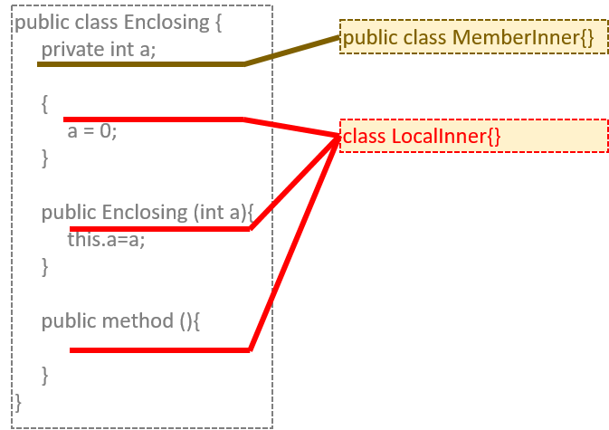
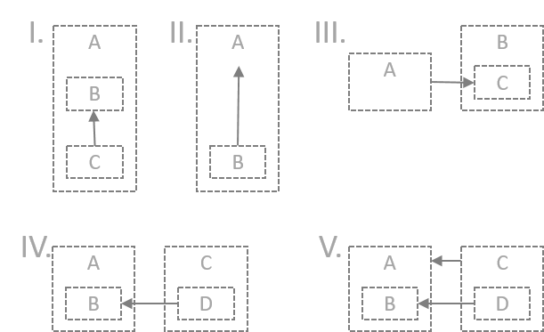

# JAVA Advanced (31089/1607/1819/1/72)
## Inner klassen en Static Member klassen
### Kennismaking

De meeste klassen waar je tot nog toe mee hebt gewerkt zijn zogenaamde *top-level*, *outer* of *enclosing classes*. Je kan binnen een klasse echter opnieuw een klasse definiëren om zo een inner klasse te bekomen:

```java
public class Outer {
	public class Inner {
	// Leden van de inner klasse
	}
	// Andere leden van de outer klasse:
	//  velden, methoden en initializers
}
```

Indien de ingesnestelde klasse statisch is, spreekt men van een *nested (top-level) class* en dan gaat het in principe niet om een echte inner klasse. Hier is een voorbeeld:

```java
public class Outer {
	public static class Nested {
	// Leden van de nested klasse
	}
	// Andere leden van de outer klasse:
	//  velden, methoden en initializers
}
```

Als je bovenstaande laat compileren door `javac.exe` zal je merken dat `Outer.java` in twee bestanden wordt omgezet: `Outer.class` en `Outer$Inner.class` respectievelijk `Outer$Nested.class`.

Merk op dat ingenestelde klassen niets met overerving of met interface implementatie te maken hebben. We gaan later zien dat overerving/implementatie en inner/outer relaties onafhankelijk van elkaar kunnen optreden. Maar laten we eenvoudig beginnen.

### Declareren van een inner klasse

Hier is een voorbeeld voor het instantiëren van een inner klasse (p. 43 $^2$):

```java
public class Car {
	private int year;

	public class Tire {
		private double radius;

		public Tire (double radius) {
			this.radius = radius;
		}

		public double getRadius() {
			return radius;
		}
	} 
	
	public Car(int year) {
		this.year = year;
	}
	
	public int getYear() {
		return year;
	}
}
```

### Soorten inner klassen

Er zijn verschillende soorten van inner klasse (zie figuur hieronder). De vorm die hierboven gedemonstreerd werd is de zogenaamde *member inner class*. Het bevindt zich in de bovenliggende klasse net als een object variabele en kan verschillende toegankelijkheid krijgen via de *access modifiers* `public`, `private` en `protected`. Een tweede vorm noemt men een *local inner class*. Deze vorm bevindt zich in een methode, een constructor of een (statische) initializer (zie figuur hieronder). Het kan geen access modifier meekrijgen en moet een publieke interface implementeren en/of overerven van een superklasse waarvan het minstens één methode overschrijft.



Er is nog een derde vorm, de zogenaamde *anonymous inner class*. Dit is hetzelfde als een lokale inner klasse maar dan zonder naam.

### Voordelen inner klassen

Voordat we in detail gaan bekijken we eerst de voordelen die inner en nested klassen classes vertonen:

- Inner klassen zijn ideaal om te voorkomen dat een object van één klasse kan worden aangemaakt alvorens een andere omringende klasse geïnstantieerd is. Voorbeelden zijn `Computer > Processor`, `Meeting Room > Presentation Equipment`, &hellip;. Hierdoor weerspiegelen de inner klassen de natuurlijke afhankelijkheden tussen de objecten.
- Bovendien zorgen inner klassen voor het hiërarchisch structureren van de namespaces.
- Inner klassen laten toe om gemakkelijk het *adaptor pattern* en *enumeration pattern* te implementeren
- 'Soort van' meervoudige overerving wordt mogelijk

### Instantiëring van een Member Inner Class

Het instantiëren van een inner klasse vereist dat de overeenkomstige outer klasse ook geïnstantieerd is. De onderstaande figuur probeert dit uit te beelden:


Dit bovenste geldt voor alle inner klassen. Hoe de instantiëring moet gebeuren, verschilt al naargelang het type inner klasse. We beginnen met de member inner klasse:

```java
package be.ap.javadv.innerclasses;

public class Outer {
	public class Inner {
		public Inner() {
			System.out.println("Instantiating Inner class.");
		}
	}

	public Outer() {
		System.out.println("Instantiating Outer class.");
	}
}
```
```java
package be.ap.javadv.innerclasses;

import be.ap.javadv.innerclasses.Outer.Inner;

public class OuterTest {
	public static void main(String[] args) {
		Outer myOuter = new Outer();
		Inner myInner = myOuter.new Inner();
	}
}
```

Opmerking bij bovenstaande code:

- De `new` operator wordt gebruikt *óp* de `Outer` klasse: `myOuter.new`
- Het declareren van `myInner` gebeurt met het type `Inner`, maar dit type is niet onmiddellijk zichtbaar vanuit de `OuterTest` klasse. Daarom moet je óf een `ìmport` toevoegen zoals in het voorbeeld óf het type explicieter maken zoals in `Outer.Inner myInner = myOuter.new Inner();`

> Oef Inn.1

### Scope van een member inner klassen

Binnen een inner klasse heeft men volledige toegang tot alle leden van de overeenkomstige omliggende klasse(n), inclusief de private leden. Dit kan men aantonen d.m.v. de bovenstaande klasse `Outer` aan te passen:

```java
package be.ap.javadv.innerclasses;

public class Outer {
	private int a;

	public class Inner {
		public Inner() {
			a++;			
			System.out.println("Incrementing from Inner, a is now " + a);
		}
	}

	public Outer() {
		a++;
		System.out.println("Incrementing from Outer, a is now " + a);
	}
}
```

Het uitvoeren van deze code geeft hetvolgende resultaat:

```
Incrementing from Outer, a is now 1
Incrementing from Inner, a is now 2
```

Dit wijst er inderdaad op dat de inner klasse de private leden van omliggende klasse kan aanspreken. Maar er is een probleem! Herinner je je dat de inner klassen een nieuwe namespace definieert. Dat betekent dat er binnen de `Inner` klasse opnieuw een private variabele `a` gedefinieerd kan worden:

```java
package be.ap.javadv.innerclasses;

public class Outer {
	private int a;

	public class Inner {
		private int a;
		
		public Inner() {
			a++;			
			System.out.println("Incrementing from Inner, a is now " +a);
		}
	}

	public Outer() {
		a++;
		System.out.println("Incrementing from Outer, a is now " + a);
	}
}
```

Als je bovenstaande code uitvoert, krijg je wel een resultaat, al dan niet zoals verwacht, maar je krijgt in ieder geval geen fout. Het wordt in complexere code wel moeilijk om te volgen welke variabele er precies wordt aangeroepen. Daarom wordt ten zeerste aanbevolen (lees: verplicht tijdens het examen!) om bij het aanroepen van variabelen binnen een inner klasse mee te geven welke variabele je precies bedoelt. Dat doe je door gebruikt te maken van het sleutelwoord `this` op een toch vrij opmerkelijke wijze:

```java
package be.ap.javadv.innerclasses;

public class Outer {
	private int a;

	public class Inner {
		private int a;

		public Inner() {
			this.a++;
			Outer.this.a++;
			System.out.println("Inner: this.a++ gives " + this.a);
			System.out.println("Inner: Outer.this.a++ gives " + Outer.this.a);
		}
	}

	public Outer() {
		this.a++;
		System.out.println("Outer: this.a++ gives " + this.a);
	}
}
```

> Oef Inn.2

Denk er verder aan dat er binnen inner klassen geen statische variabelen gedeclareerd mogen worden tenzij het over CT constanten gaat:

```java
package be.ap.javadv.innerclasses;

public class Outer {
	public static int outPubSta = 42; // OK

	public class Inner {
		public static int innPubSta = 42; // NOK
		public static final int INN_PUB_STA_FIN_CT = 42; // OK
		public static final String INN_PUB_STA_FIN_RT = new String ("Forty two"); //NOK
	}
}
```

De lijnen in bovenstaande code geven een CT fout gelijkaardig aan deze:

```
The field innPubSta cannot be declared static in a non-static inner type, unless initialized with a constant expression - Java (33554778)
```

### Overerving met member inner klassen

Onderstaande figuur toont verschillende overervingsconfiguraties. In scenario I. zie je bijvoorbeeld hoe er binnen een omliggende klasse A twee inner klassen bestaan (B en C) en hoe de inner klasse C overerft van inner klasse B. In het tweede scenario (II.) zie je hoe een inner klasse B ook rechtstreeks van *een* omliggende klasse A kan overerven. Overerving kan ook gebeuren door klassen die niet tot een 'familie' behoren (III.). Hier erft de klasse A over van een inner klasse C die zich zelf binnen klasse B bevindt. Zo kunnen twee inner klassen uit twee verschillende 'families' ook van elkaar overerven (IV.) en kunnen zelfs de respectievelijke omliggende en inner klassen onafhankelijk van elkaar overerven (V.).



Het declareren van de klassen staat voor al deze scenario's hieronder uitgebeeld. Voor de scenario's I. en II. is het nog vrij eenvoudig:

```java
// Scenario I
//   Declaration
public class A {
	public class B {}
	public class C extends B {}
}
//   Instantiation
A a = new A();
A.B b = a.new B();
A.C c = a.new C();

// Scenario II
//   Declaration
public class A {
	public class B extends A {}
}
//   Instantiation
A a = new A();
A.B b = a.new B();
```
Voor scenario III. moet je iets speciaal doen. Indien je dit probeert:

```java
public class A extends B.C {
}
```

,dan zal de compiler de volgende melding geven:

```
No enclosing instance of type B is available due to some intermediate constructor invocation - Java(536870940)
```

Het is inderdaad logisch dat de bovenliggende klasse van B zeker geïnstantieerd moet worden alvorens de klasse A ervan kan overerven. Zoals de foutmelding meegeeft, kan je dit oplossen door de omliggende klasse als parameter mee te geven met de constructor. Je zal merken dat de CT fout nu verdwijnt. Merk op dat je dan natuurlijk ook de omliggende klasse eerst moet instantiëren en dan meegeven bij het instantiëren van de subklasse:

```java
// Scenario III
//   Declaration
public class A extends B.C {
	public A (B b){
		b.super(); // Moet eerst uitdrukking zijn binnen constructor
	}
}
//   Instantiation
B b = new B();
A a = new A(b);
```

Voor wat betreft de scenario's IV. en V. moet je enkel de bovenstaande regel toepassen voor scenario IV:

```java
// Scenario IV
//   Declaration
public class A {
	public class B {}
}
public class C {
	public class D extends A.B{
		public D(A a){
			a.super();
		}
	}
}
//   Instantiation
C c = new C();
A a = new A();
C.D d = c.new D(a);

// Scenario V
//   Declaration
public class A {
	public class B {}
}
public class C extends A {
	public class D extends B{}
}
//   Instantiation
C c = new C();
C.D d = c.new D();
```

> Oef Inn.3

### Lokale inner klassen

Het onderstaand lijstje laat de 4 belangrijkste verschillen zien met member inner klassen:

1. Een lokale inner klasse vind je op andere plaatsen in de bovenliggende klasse, namelijke binnen een methode, een constructor of een initializer
2. Vóór een lokale inner klasse zet je niet `public`, `private` of `protected`, de toegankelijkheid wordt bepaald door het bovenliggend element
3. De naam van het overeenkomstig `.class` bestand ziet er zo uit: `<outer-class-name>$<a-number><local-inner-class-name>`
4. Lokale variabelen van het omliggend element (methode, constructor of initializer) die je binnen de lokale inner klasse wil gebruiken moeten effectieve constanten (*Effectively final*) zijn omdat deze niet langer bereikbaar nadat de uitvoering van het omliggende element afgelopen is 

De drie eerste verschillen behoeven geen verdere uitleg. Het vierde puntje is toch iets minder voordehandliggend. Een voorbeeld zal dit snel verduidelijken. bekijk de onderstaande code, veronderstel dat de superklasse A bestaat:

```java
public class Outer {
	private int outerVar=0;

	public A myOuterMethod (){
		int locVar = 0;
		
		class LocalInner extends A {
			private int innerVar=0;
			@Override
			public String toString() {
				innerVar++; // OK
				outerVar++; // OK
				locVar++; // NOK
				return this.innerVar + " - " +  Outer.this.outerVar + " - " + locVar; 
			}
		}
		
		A li = new LocalInner();
		return (li);
	}
}
```

De code laat de lokale inner klasse `LocalInner` zien die zich binnen de methode `myOuterMethod()` bevindt op de omliggende klasse `Outer`. De `toString()` tracht drie variabelen aan te spreken. De eerste is `innerVar`, een lokaal privaat veld. Dit geeft uiteraard geen probleem. Dan is er het privaat veld `outerVar` dat zich op de omliggende klasse bevindt. Ook hier is er geen probleem, de inner klasse kan al de velden aanspreken van al de omliggende klassen. Het probleem zit hem met het tussenniveau. De variabele `locVar` is een lokale variabelen van de methode `myOuterMethod()` en vanaf dat die methode klaar is met uitvoeren, verdwijnen ook de lokale variabelen. Daarom laat de compiler niet toe om deze variabele nog te wijzigen. De code zoals die hierboven staat genereert dan ook de volgende CT fout:

```
 Local variable locVar defined in an enclosing scope must be final or effectively final - Java (536871575)
 ```

Het in commentaar zetten van de lijn `locVar++;` is voldoende om de CT fouten weg te nemen en nu kan je de klasse instantiëren:

```java
Outer myOuter = new Outer();
A myInner = myOuter.myOuterMethod();
System.out.println(myInner);
```

Merk op dat de `locVar` dus een effectieve constante moet zijn maar dat (sinds Java 8) het `final` sleutelwoord niet nodig is. Het getuigt natuurlijk van een juiste programmeer houding om dit sleutelwoordje toch te gebruiken, kwestie om de situatie in de code te verduidelijken:

```java
final int locVar = 0;
```

Hieronder zie een representatief voorbeeld van een lokale inner klasse (p. 44 $^2$):

```java
package be.ap.javadv.innerclasses;

import java.util.ArrayList;
import java.util.Iterator;

public class TitleList {
	private ArrayList<String> titleList = new ArrayList<>();

	public void addTitle(String title) {
		titleList.add(title);
	}

	public void removeTitle(String title) {
		titleList.remove(title);
	}

	public Iterator<String> titleIterator() {
		class TitleIterator implements Iterator<String> {
			int count = 0;

			@Override
			public boolean hasNext() {
				return (count < titleList.size());
			}

			@Override
			public String next() {
				return titleList.get(count++);
			}
		}
		
		TitleIterator titleIterator = new TitleIterator();
		return titleIterator;
	}
}
```

> Oef Inn.4

### Anonieme Lokale Inner Klassen

Lokale inner klassen kunnen anoniem zijn, dus geen naam hebben. Net als bij de benoemde lokale inner klassen krijgen ze hun eigen `.class` bestand tijdens het compileren. De naam van dit bestand zal echter het patroon `<outer-class-name>$<a-number>` hebben. Hier volgt hetzelfde voorbeeld als hierboven maar nu als anonieme lokale inner klasse (p. 50 $^2$):

```java
package be.ap.javadv.innerclasses;

import java.util.ArrayList;
import java.util.Iterator;

public class TitleListWithInnerClass {
	private ArrayList<String> titleList = new ArrayList<>();

	public void addTitle(String title) {
		titleList.add(title);
	}

	public void removeTitle(String title) {
		titleList.remove(title);
	}

	public Iterator<String> titleIterator() {
		// An anonymous class
		return new Iterator<String>() {
			int count = 0;

			@Override
			public boolean hasNext() {
				return (count < titleList.size());
			}

			@Override
			public String next() {
				return titleList.get(count++);
			}
		}; // Anonymous inner class ends here
	}
}
```

De algemene vorm is:

```java
new <interface-name or superclass-name> (<argument-list>) {
	// Anonymous class body goes here
}
```

Omdat de anonieme klassen geen naam hebben lopen de declaratie en instantiëren samen en kan je slechts 1 object maken van deze klasse (*one-time class*).

### Termen

| Term | Betekenis            |
|------|----------------------|
| CT   | Compile-time         |
| GC   | Garbage Collector    |
| FIFO | First in, first out  |
| JVM  | Java Virtual Machine |
| LIFO | Last in, first out   |
| OO   | Object georiënteerd  |

### Referenties

||Literatuur|
|-|-|
|<sup>1</sup>|Sharan K (2014) Beginning Java 8 Fundamentals: Language Syntax, Arrays, Data Types, Objects, and Regular Expressions. Apress. ISBN: 978-1-4302-6653-2.|
|<sup>2</sup>|Sharan K (2014) Beginning Java 8 Language Features: Lambda Expressions, Inner Classes, Threads, I/O, Collections, and Streams. Apress. ISBN: 978-1-4302-6659-4.|
|<sup>3</sup>|Sharan K (2014) Beginning Java 8 APIs, Extensions and Libraries: Swing, JavaFX, JavaScript, JDBC and Network Programming APIs. Apress. ISBN: 978-1-4302-6662-4.|