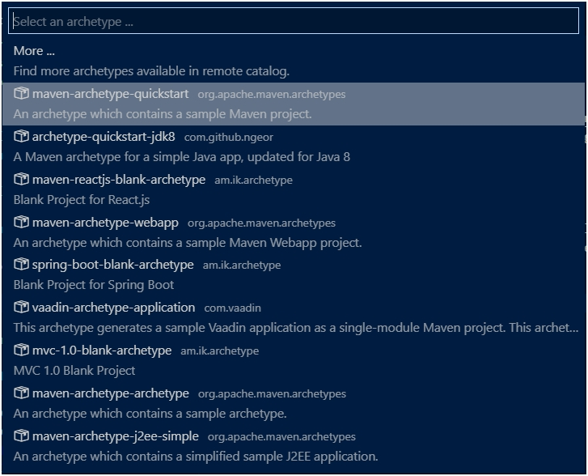

# JAVA Advanced (31089/1607/1819/1/72)
## Hibernate
### Inleiding

Hibernate is een ORM tool waarvan de ontwikkeling gestuurd werd door [Red Hat](https://nl.wikipedia.org/wiki/Red_Hat). Het dient om een relationele databank te koppelen met klassen waarop rechtreeks de business logica geprogrammeerd kan worden. Het framework verzorgt de data typering, data toegangsfuncties (getters) en query management.

### Installatie

Omdat we nu voor het eerst complexere applicaties gaan maken, beginnen we met de installatie van [Maven](http://maven.apache.org/) alsook de VS Code extensie `Maven for Java`. Als je Maven nog niet kent, kan je een Maven archetype uitproberen met de VS Code opdracht  `Maven: Generate from Maven archetype` >

### Termen

| Term | Betekenis                 |
|------|---------------------------|
| CT   | Compile-time              |
| GC   | Garbage Collector         |
| FIFO | First in, first out       |
| JVM  | Java Virtual Machine      |
| LIFO | Last in, first out        |
| OO   | Object georiënteerd       |
| ORM  | Object-relational mapping |

### Referenties

||Literatuur|
|-|-|
|1|Sharan K (2014) Beginning Java 8 Fundamentals: Language Syntax, Arrays, Data Types, Objects, and Regular Expressions. Apress. ISBN: 978-1-4302-6653-2.|
|2|Sharan K (2014) Beginning Java 8 Language Features: Lambda Expressions, Inner Classes, Threads, I/O, Collections, and Streams. Apress. ISBN: 978-1-4302-6659-4.|
|3|Sharan K (2014) Beginning Java 8 APIs, Extensions and Libraries: Swing, JavaFX, JavaScript, JDBC and Network Programming APIs. Apress. ISBN: 978-1-4302-6662-4.|