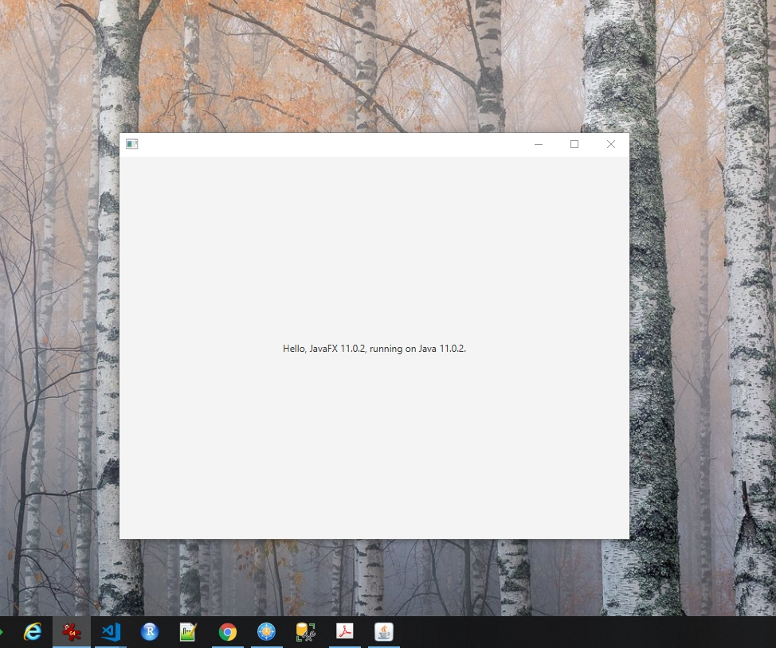

# JAVA Advanced (31089/1607/1819/1/72)
## JavaFX
### Introduction

We are now ready to build a standalone application from scratch using JavaFX. JavaFX is one of several UI frameworks (next to e.g. Adobe Flex) and it can be regarded as the successor of Java Swing. For the development of JavaFX application there exists many aides such as the scripting languages Visage, Groovy, Scala, Nashorn and visual editors such as Oracle's Scene Builder. Furthermore, JavaFX supports out-of-the-box forms, video and audio-streaming, animation, a drawing canvas, charts, etc....

In comparison with web-applications, you have to do a little bit more coding, on average, but is pays off. A standalone application does not have to bend for the standards and the browsers and the programmer has more flexibility. Let us try to demonstrate this by building a small standalone application that helps you with your appointments:


### Getting Started

Let us get started and I will explain everything you need to know along the way. First, follow [these instructions](https://openjfx.io/openjfx-docs/) for setting up a Maven project and replace the code in `App.java` by the code below:

```java
package javafx;

import javafx.application.Application;
import javafx.scene.Scene;
import javafx.scene.control.Label;
import javafx.scene.layout.StackPane;
import javafx.stage.Stage;

public class App extends Application {

	@Override
	public void start(Stage stage) {
		String javaVersion = System.getProperty("java.version");
		String javafxVersion = System.getProperty("javafx.version");
		String message = String.format("Hello, JavaFX %s, running on Java %s.",
			javafxVersion, javaVersion);

		Label l = new Label(message);
		Scene scene = new Scene(new StackPane(l), 640, 480);
		
		stage.setScene(scene);
		stage.show();
	}

	public static void main(String[] args) {
		launch(args);
	}
}
```

In the console, in the folder where `POM.xml` resides, you start the application with `mvn compile exec:java`. If all goes well, you should see something like this:



Let us take a second to investigate the code above. In order to instantiate a running application, you need to extend from the `javafx.application.Application` class from which you override the `start` method. This method accepts a `Stage` object but returns nothing. See details of this method and other information on the JavaFX framework [here](https://openjfx.io/javadoc/11/javafx.graphics/javafx/application/Application.html#start(javafx.stage.Stage)). In the documentation, you will also find the 2 overloads of the `launch` method as well as the equally important `init` and `stop` methods. As you may have guessed already from such a construct of `launch()` and `start()` methods, JavaFX application run in a separate thread, the so called *JavaFX Application Thread*.

### The Stage

The stage is a container for a scene graph which consists of a hierarchical collection of visual elements (the nodes of the [graph](https://en.wikipedia.org/wiki/Graph_theory). An application can have multiple stages but should always have at least one (the so called *Primary Stage*). As mentioned before, the visual elements can be text, shapes, images, controls, animations, effects, etc&hellip;.

The stage object can be used to:

- Initialize, start and stop the application
- Decide on the style of the window, e.g. whether decorations (border, title, cross on top right, &hellip;)
- Change the opacity of the main window
- Change (initial) (z-) position and size
- Define the application's modality (how to handle multiple windows)
- Define icons
- Change the title
- Add a scene graph

See [here](https://openjfx.io/javadoc/11/javafx.graphics/javafx/stage/Stage.html#method.summary) for more details.

### The Scene Graph

Aas mentioned, a scene graph is a hierarchical collection of scenes. Any `Scene`-derived object that also inherits from the `javafx.scene.Parent` class can be used as a container for other scenes and as such allow you to build a scene graph. Examples of such parents (also called *Layouts* or *Layout panes*) are `VBox`, `HBox`, `Pane`, `FlowPane`, `GridPane`, `TilePane`, etc&hellip;.

### The Window Background

First we will draw the background of our application. Let us create it from scratch so that we can easily change it afterwards. For this, it is best to use a vector drawing program such as Inkscape that enables immediate export to JavaFX Scene Graph. Either draw it 


### Events

javafx-basic-archetype

In JavaFX, events, user inputs, timers etc...  are being handled by the *JavaFX Application Thread*.

- Inkscape SVG elements into JavaFX Scene Graph API elements (.fx file). Now the drawing is a JavaFX class that extends from CustomNode. Once in your classpath (in this case the same directory of your main code) you can call it:

```java
//http://silveiraneto.net/2008/11/21/inkscape-and-javafx-working-together/
import javafx.scene.paint.Color;
var girl = Girl{}
girl.rightiris.fill = Color.LIME;
girl.fringe.fill = Color.WHITE;
girl.backhair.fill = Color.DARKGRAY;
girl.hair.fill = Color.GRAY;
import javafx.input.MouseEvent;
var p = Player{}
p.x.onMouseClicked = function( e: MouseEvent ):Void {
java.lang.System.exit(0);
}
//transformations
import javafx.application.Frame;
import javafx.application.Stage;
import javafx.scene.effect.SepiaTone;
 
var girl = Girl{
   scaleX: 0.5
   scaleY: 0.5
   effect: SepiaTone{}
}
 
Frame {
   visible: true
   stage: Stage {
      content: [girl]
   }
}

//https://blogs.oracle.com/geertjan/new-tutorial:-integrating-javafx-charts-into-the-netbeans-rcp-part-1
```


### Terms and Abbreviations

| Term | Meaning              |
|------|----------------------|
| CT   | Compile-time         |
| GC   | Garbage Collector    |
| FIFO | First in, first out  |
| JVM  | Java Virtual Machine |
| LIFO | Last in, first out   |
| OO   | Object oriented      |

### References

||Reference|
|-|-|
|<sup>1</sup>|Sharan K (2014) Beginning Java 8 Fundamentals: Language Syntax, Arrays, Data Types, Objects, and Regular Expressions. Apress. ISBN: 978-1-4302-6653-2.|
|<sup>2</sup>|Sharan K (2014) Beginning Java 8 Language Features: Lambda Expressions, Inner Classes, Threads, I/O, Collections, and Streams. Apress. ISBN: 978-1-4302-6659-4.|
|<sup>3</sup>|Sharan K (2014) Beginning Java 8 APIs, Extensions and Libraries: Swing, JavaFX, JavaScript, JDBC and Network Programming APIs. Apress. ISBN: 978-1-4302-6662-4.|