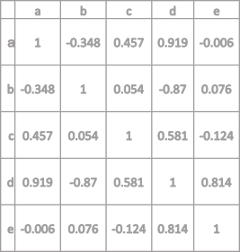

# JAVA Advanced (31089/1607/1819/1/72)
## Oefeningen [&plusmn;16 hrs and counting...]
### Oefeningen Recap [3 hrs]
#### Oef Recap.1 [20 min]

*Deze oefening dient om kennis te maken met VS Code en de `Debugger for Java` extensie.*

In jouw VS Code IDE maak je een nieuwe Java toepassing aan met de opdracht `Java: Create Java Project`. Doe dit door op F1 of `ctrl + shift + P` te drukken en deze opdrachtnaam op te geven. Tijdens het typen verschijnt er een keuzelijst met de opdracht. Gebeurt dit niet dan ontbreekt er misschien een VS Code extensie, kijk opnieuw de installatie na. Van het nieuwe project verwijder je de standaard package `app` in de `src` folder en maak je een nieuwe folder structuur aan die de bovenstaande pakketnaam volgt (`be.ap.javadv.recap` wordt `src\be\ap\javadv\recap`).
Typ nu het onderstaand programma manueel over in jouw VS Code IDE (zo krijg je snel weer Java in de vingers) en bewaar het bestand als `ProgramParts.java`. Denk eraan dat de bestandsnaam *exact* moet overeenstemmen met de klassenaam.

```java
// Package declaration
package be.ap.javadv.recap;

// Import declaration
import java.lang.System;

// Type declaration
public class ProgramParts {
	public static void main(String[] args) {
		System.out.println("Hello World!");
	}
}
```

Ga nu kijken naar de `bin` folder. Als alles juist geïnstalleerd is, zie dat VS Code de compilatie van broncode naar bytecode volautomatisch heeft uitgevoerd. Nu kan je de main methode uitvoeren en in de console verwacht je de zin `Hello world!` te zien verschijnen. Je kan de console/terminal/foutberichtvenster tonen en verbergen met de toets combinatie `ctrl + ù`.

#### Oef Recap.2 [20 min]

*Deze oefening dient om inzicht te verwerven in het compilatie process van Java.*

Tracht het `ProgramParts.class` bestand uit de Oef Recap.1 te decompileren. Gebruik hiervoor `jad.exe` ([hier](http://www.javadecompilers.com/jad) kan je die vinden) en werk vanuit het terminal paneel binnen VS Code. Probeer eerst eens gewoon `jad <bestandsnaam>` uit te voeren. Je krijgt als resultaat een `.jad` bestand in dezelfde folder. Open het `ProgramParts.jad` bestand en vergelijk de inhoud ervan met het oorspronkelijk `ProgramParts.java` bestand (in VS Code kan je met de opdracht `file: Compare Active File With` bestanden zij-aan-zij vergelijken). Sluit het `ProgramParts.jad` bestand en doe nu hetzelfde, maar nu met het `-dis` argument (geef mee dat het `ProgramParts.jad` mag overschreven worden). Dit argument zorgt ervoor dat je de bytecode te zien krijgt.

#### Oef Recap.3 [10 min]

*Deze oefening dient om kennis te maken met de gereserveerde sleutelwoorden in Java*

```
 abstract  continue  for         new        switch       
 assert    default   goto        package    synchronized 
 boolean   do        if          private    this         
 break     double    implements  protected  throw        
 byte      else      import      public     throws       
 case      enum      instanceof  return     transient    
 catch     extends   int         short      try          
 char      final     interface   static     void         
 class     finally   long        strictfp   volatile     
 const     float     native      super      while        
 true      false     null
```

 Bekijk de lijst van bovenstaande sleutelwoorden aandachtig. Probeer zelf eens een variabele te declareren met een van deze sleutelwoorden en bekijk de CT fout die daarop volgt. Onthou de fout en de oorzaak zodat je de volgende keer dat je deze fout tegenkomt (bijvoorbeeld op het examen) weet wat je te doen staat.

#### Oef Recap.4 [30 min]

*Deze oefening dient om betrouwd te geraken met het spontaan omzetten van probleem naar for-lussen, if- en andere constructies.*

Gebruik naar keuze `for`, `while`, `if` en andere constructies om rechtstreeks vanuit een main methode de onderstaande correlatiematrix in de console af te drukken (niet de lijntjes, enkel de kolom en rij hoofdingen en de inhoud van de matrix).



Vertrek vanuit een twee-dimensionale array van het gepaste type. Druk eerste de matrix volledig af en druk daarna de onderste halve matrix af (enkel de waarden *onder* de diagonaal). Maak een versie die gebruik maakt van een gewone `for`-lus en eentje die van een `for each` gebruik maakt. Werk met arrays.

#### Oef Recap.5 [30 min]

*Deze oefening dient om betrouwd te geraken met het spontaan omzetten van probleem naar for-lussen, if- en andere constructies en begrijpen waar zulke constructies passen bij het gebruik van klassen.*

Maak een `ChessBoard` klasse aan dat een schaakbord-patroon aanmaakt en afdrukt. De klasse heeft een constructor die een parameter `size` aanvaardt. Deze parameter bepaalt de grootte van het 'schaakbord'. Maak dan de methode `createBoard` die een twee-dimensionale array aanmaakt en bewaart in een objectvariabele `board`. Een tweede methode (`print`) drukt het schaakbord af gebruik makende van de characters `■` (code = `0x25A0`) en `□` (code = `0x25A1`) en van de opdracht `out.printf ( "%c ", /*code hier*/ )`. Een voorbeeld (`size=4`) staat hieronder:

```
□ ■ □ ■
■ □ ■ □
□ ■ □ ■
■ □ ■ □
```

#### Oef Recap.6 [45 min]

*Deze oefening dient om betrouwd te geraken met het spontaan omzetten van objecten uit de echte wereld alsook leren nadenken over de toegankelijkheid van de leden van een klasse.*

Denk aan jouw lievelings 'object' in de echte wereld, iets uit je eigen interesseveld, en vertaal dit naar een Java klasse. Voorbeelden kunnen zijn *Jetski*, *Dromedaris*, *SmartPhone*, *E-boek*. Denk na over wat voor methodes de klassen allemaal zou kunnen hebben. Probeer hieruit 2 methodes te kiezen die je `private` zou zetten en twee die `public` zou zetten (geen getters en setters). Zoek nu ook telkens 2 object- en klasse variabelen die bij de klasse zouden kunnen horen en schrijf getters en setters voor de private variabelen. Implementeer de klasse en schrijf er een testklasse voor (`public class <klassenaam>Test`) met daarin een uitvoerbare methode die alle publieke methoden uittest. Zorg dat elke methode iets naar de console wegschrijft.

#### Oef Recap.7 [25 min]

*Deze oefening laat zien hoe je de standaard methodes van de `Object` klasse kunt overschrijven.*

Voeg aan jouw lievelingsklasse uit Oef Recap.6 een `toString()` methode toe die de gelijknamige methode van de `Object` klasse overschrijft en die alle private variabelen uitleest en omzet naar een gestructureerde tekenreeks. Voeg een lijn toe aan de bijhorende testklasse om het object af te drukken (i.e. `System.out.print ( mijnObject );`). Voorbeelden van outputs (zie Oef Recap.6) zouden kunnen zijn:

- `Jetski RF7654 (243 vaaruren)`
- `Mia komt van Zoo Antwerpen`
- `iPhone 4S, launched in 2011`
- `Sense and Sensibility — Jane Austen`

Je kan in de `toString()` methode gebruik maken van `printf()`.

### Collections [5 hrs 55 min]
#### Oef Coll.1 [30 min]

*In deze oefening leer het principe achter hashing beter te begrijpen. Het spoort ook aan de documentatie te raadplegen.*

Bekijk onderstaande code:

```java
Human lisa = new Human ( "Lisa", "female" );
Human ahmed = new Human ( "Ahmed", "male" );

out.println ( "Are Lisa and Ahmed the same human?" );
out.println ( "The answer is " +
	((Objects.hash(lisa) != Objects.hash(ahmed)) ? "No." : "Maybe."));
```

Maak een `Human` klasse aan om deze code te kunnen uitesten vanuit de `HumanTest` klasse. Probeer zowel de `.hashCode()` en `Objects.hash()` methodes eens aan te roepen en vergelijk het resultaat. In de Oracle documentatie staat ook iets over deze vergelijking. Zoek het op en lees het. Kijk daarna eens wat gebeurt er als je twee `Human`-objecten aanmaakt met dezelfde naam en geslacht. Hebben deze twee objecten dan dezelfde hash code?

#### Oef Coll.2 [120 min]

*Deze oefening laat zien hoe je een slimme hash-code kan maken;*

Maak een klasse `Point` dat voor de coördinaten de publieke object variabelen `x`, `y` en `z` definieert. Het bereik van de coördinaatwaarden (type `float`) is beperkt in het gebied \[0, 9.5[. Overschrijf de `hashCode` methode van deze `Point` klasse zodat het resulteert in een natuurlijk getal van 0 tot 999, waarbij elke cijfer een afronding is van het overeenkomstig coördinaat. Schrijf nu een test methode `PointTest.main` waarbij er `10_000` punten worden gegenereerd met coördinaten willekeurig (en uniform) verdeeld over het toegelaten gebied. Denk eraan om zulke waarde als het aantal punten altijd als constante te definiëren, vooraan in de methode:

```java
final int MAX = 10_000;
```

Bewaar de gegenereerde punten in een array `points`. Gebruik nu het resultaat van `mijnPunt.hashCode()` om de afstand te berekenen tussen twee willekeurig gekozen punten uit de lijst en herhaal dit `n`-aantal keren (waarbij `n` weer als constante gedefinieerd staat in jouw `main` methode) en bereken telkens het gemiddelde. Hier is de formule voor afstand tussen 2 punten:

$$d=\sqrt{\Delta x^2+\Delta y^2+\Delta z^2}$$

waarbij bijvoorbeeld $\Delta x^2=(x_2 - x_1)^2$. Controleer of bij toenemende `N` de gemiddelde afstand $\bar{d}$ naar een limiet nijgt door manueel een handvol verschillende waarden voor `N` uit te proberen.

#### Oef Coll.3 [45 min]

*Deze oefening helpt met het inzicht verwerven dat generieke klassen nuttig kunnen zijn.* 

Maak een generieke klasse `KeyValues` die zogenaamde [key-value pairs](https://en.wikipedia.org/wiki/Key-value_database) bijhoudt. Initialisatie gebeurt door middel van twee arrays. Een getter geeft de value terug op basis van een key. Denk na over de toegelaten types.

#### Oef Coll.4 [60 min]

*Deze oefening moet aanleren om zelf een functionele generiek klasse aan te maken.* 

Maak een generieke klasse `Ontology` waarin objecten met elkaar geassocieerd kunnen worden. De initialisatie van dit semantisch web gebeurt aan de hand van een array van objecten. Daarna kan de ontwikkelaar gebruik maken van de methode `makeLink ( object A, object B, Link L )` waarbij L een instantie is van de zelf aan te maken klasse `Link` of een object dat daarvan overerft en waarbij de types voor objecten A en B hetzelfde moeten zijn. De klasse `Link` heeft de object variabelen `LocalDate startDate` en `String description`.  Schrijf een `toString()` voor deze klasse die mooi alle relaties binnen de ontologie afdrukt, bijvoorbeeld:

```
"My object A" ——— depends on ———> "My object B" (since 2018-04-13)
"My object A" ——— works with ———> "My object C" (since 2017-01-26)
```

Implementeer de klasse eerst om relaties tussen `String` objecten af te handelen en daarna om relaties tussen `Human` objecten af te handelen.

#### Oef Coll.5 [15 min] (extra)

*Deze oefening dient om de flexibiliteit van enumeraties te demonstreren.*

Laat onderstaande code (p. 717-718 $^1$) compileren en bestudeer hoe `javac.exe` meerdere `.class` bestanden genereert. Bestudeer de code dan en probeer te begrijpen wat er gebeurt.

```java
package be.ap.javadv.collections;

public enum SuperSmartSeverity {
	LOW("Low Priority", 30) {
		public double getProjectedCost() {
			return 1000.0;
		}
	},
	MEDIUM("Medium Priority", 15) {
		public double getProjectedCost() {
			return 2000.0;
		}
	},
	HIGH("High Priority", 7) {
		public double getProjectedCost() {
			return 3000.0;
		}
	},
	URGENT("Urgent Priority", 1) {
		public double getProjectedCost() {
			return 5000.0;
		}
	};
	// Declare instance variables
	private String description;
	private int projectedTurnaroundDays;

	// Declare a private constructor
	private SuperSmartSeverity(String description, int projectedTurnaroundDays) {
		this.description = description;
		this.projectedTurnaroundDays = projectedTurnaroundDays;
	}

	// Declare a public method to get the turn around days
	public int getProjectedTurnaroundDays() {
		return projectedTurnaroundDays;
	}

	// Override the toString() method in the Enum class to return description
	@Override
	public String toString() {
		return this.description;
	}

	// Provide getProjectedCost() abstract method, so all constants
	// override and provide implementation for it in their body
	public abstract double getProjectedCost();
}

public class SuperSmartSeverityTest {
	public static void main(String[] args) {
		for (SuperSmartSeverity s : SuperSmartSeverity.values()) {
			String name = s.name();
			String desc = s.toString();
			int ordinal = s.ordinal();
			int projectedTurnaroundDays = s.getProjectedTurnaroundDays();
			double projectedCost = s.getProjectedCost();
			System.out.println("name=" + name + ", description=" + desc + ", ordinal=" + ordinal + ", turnaround days="
					+ projectedTurnaroundDays + ", projected cost=" + projectedCost);
		}
	}
}
```

#### Oef Coll.6 [45 min]

*Deze oefening moet aanleren om een nieuwe interface aan te maken op basis van bestaande implementation classes van het Java Collection Framework*

Maak een nieuwe interface `LIFOQueue` met volgende methoden: `isEmpty()`, `push()`, `pop()`, en `peek()`. Maak een klasse ArrayLIFOQueue die deze implementeert. Intern maakt het gebruik van een `ArrayDeque` object.

#### Oef Coll.7 [20 min]

*Deze oefening om beter inzicht te verwerven in het doorlopen van collecties.*

Probeer de volgende code werkende te krijgen:

```java
List<String> names = new ArrayList<>();

names.add ("Abu");
names.add ("Bob");
names.add ("Bea");

Iterator<String> nameIterator = names.iterator();

while(nameIterator.hasNext()) {
	String name = nameIterator.next();
	if ( name.toString() == "Bob" ){
		nameIterator.remove();
	}
}
```

Probeer nu in bovenstaande code gebruik te maken van een for-each lus en je zou een CT fout moeten bekomen. Zoek de bijhorende` Exception` op in de documentatie.

#### Oef Coll.8 [20 min]

*Deze oefening leert om te gaan met sets.*

Maak een nieuwe set aan (`Set`) en voeg eens twee dezelfde waarden toe. Wat gebeurt er? Krijg je een foutmelding?

### Inner classes [3 hrs 45 min]
#### Oef Inn.1 [40 min]

*Deze oefening dient om eens kennis te maken met inner klassen en het aanmaken van inner objecten.*

Gegeven de klassen `Customer`, `Invoice`, `Product`, `Price`, `Address` en `ProductClass`, probeer een logisch verband te vinden tussen deze klassen en probeer waar mogelijk inner klassen te gebruiken. Maak dan een testklasse `Order` aan van waaruit een factuur wordt opgesteld met een vijftal producten. Het afdrukken van de factuur moet een resultaat geven gelijkaardig aan het volgende:

```
Invoice No <Invoice.number>
<Customer.name>
<Customer.address.line1>
<Customer.address.line2>

<Product.name1>		<quantity>		<price>
<Product.name2>		<quantity>		<price>
<Product.name3>		<quantity>		<price>
<Product.name4>		<quantity>		<price>
<Product.name5>		<quantity>		<price>

				Total:	<totalPrice>
```

#### Oef Inn.2 [25 min]

*Deze oefening zet aan tot het organiseren van objecten uit de echte wereld in een hiërarchische structuur van inner klassen*

Maak een klasse `Library` aan met de in elkaar gestelde inner klassen `Cabinet`, `Shelf`, `Book`. Elk van deze klassen heeft een private `id` variabele. Voor de `Library` klasse is de `id` de naam van de bibliotheek, voor de anderen een oplopend natuurlijk getal beginnend met 1. De klasse `Book` heeft een methode `getFullId()` die met `String` teruggeeft die bestaat uit de door een `.` gescheiden aaneenschakeling van de `id`'s van alle omliggende klassen (e.g. 'LeuvenseStadsBibliotheek.131.3.28').

#### Oef Inn.3 [120 min]

*Deze oefening dient om te laten inzien dat overerving onafhankelijk is en combineerbaar met het systeem van een hiërarchische boomstructuur van inner klassen. Het is ook een herhaling op het gebruik van de juiste types collecties.*

Hier volgt een lijst van klasse namen met wat uitleg. Probeer ze in een logische structuur te gieten van Member inner klassen. Maak gebruik van inner klassen en pas overerving toe waar nodig.

- `School` (e.g. "AP") heeft een `name` en `departments`, een collectie van `Department`
- `Department` (e.g. "WT") heeft een `name` en een collectie van `Education`
- `Education` (e.g. "TI") een opleiding, heeft een `name`, een collectie vzn `Lesson` gekoppeld met `LessonMaterial`, een `lectorCorps` (lectorenkorps) en een collectie van `Class`
- `LectorCorps`
- `Class` (e.g. 2TI) met een `String name` en collectie van `Group`
- `Group` (e.g. 2TIA) een soort 'klas binnen een klas'  met een `String name` en een collectie van `Student`
- `Student`
- `Person` met een `String name`
- `PersonList` (i.e. een collectie van `Person`)
- `Lector`
- `Lesson` met een `String title`, een `Lector`, een `Group` en `LessonMaterial`
- `Lab`
- `Theory`
- `LessonMaterial` (i.e. een onderdeel van de `Course`) bestaat uit een collectie van `Slide`
- `Course` (i.e. het eigenlijke digitale/papieren cursusmateriaal) is een collectie van `LessonMaterial`
- `Slide` (i.e. een onderdeel van `LessonMaterial`) met een `String title` en met `String content`

Maak dan een testklasse met daarin één school, één departement, twee opleidingen met telkens 1 à 2 schoolklassen, een korps van 1 à 2 lectoren en 1 tot 2 Lessen, enz&hellip;.

#### Oef Inn.4 [40 min]

*Deze oefening leert om bestaande code te leren analyseren zodat bij het tegenkomen van nieuwe structuren er toch een beeld gevormd kan worden van wat de bedoeling precies is.*

Onderzoek onderstaande code.

```java
package be.ap.javadv.innerclasses;

import java.util.ArrayList;
import java.util.Iterator;

public class TitleList {
	private ArrayList<String> titleList = new ArrayList<>();

	public void addTitle(String title) {
		titleList.add(title);
	}

	public void removeTitle(String title) {
		titleList.remove(title);
	}

	public Iterator<String> titleIterator() {
		class TitleIterator implements Iterator<String> {
			int count = 0;

			@Override
			public boolean hasNext() {
				return (count < titleList.size());
			}

			@Override
			public String next() {
				return titleList.get(count++);
			}
		}
		
		TitleIterator titleIterator = new TitleIterator();
		return titleIterator;
	}
}
```

Probeer een test klasse te schrijven om na te gaan wat er gebeurt indien je:

1. Titels toevoegt
2. Een `titleIterator()` declareert en bewaart om doorheen de lijst te lopen
3. Opnieuw titels toevoegt
4. Opnieuw de `titleIterator()` gebruikt om de lijst te doorlopen. Worden de laatst toegevoegde titels door de iterator opgepikt?

### Annotaties [40 min]
#### Oef Ann.1 [10 min]

*Deze oefening dient om op basis van een probleemstelling een zoekopdracht uit te voeren in de documentatie en om een glimp te krijgen van de vrij beschikbare annotatie types.*

In de documentatie van Oracle voor Java 11 staan 47 annotatietypes gedefinieerd. Zoek de overzichtpagina waar deze allemaal staan opgesomd en zoek in deze lijst naar diegene die dient om een gebeurtenisveld te annoteren en om aan te geven dat de waarden van dit veld een tijdsduur aangeven. Maak de gepaste annotatie bij onderstaande klasse zodat de tijsduur van 2.9872 seconden wordt opgegeven:

```java
public class DataFetch extends Event {
    private String bigData;
 
    public void setBigData(String bigData) {
        this.bigData = bigData;
    }
 
    public String getBigData() {
        return bigData;
    }
}
```

#### Oef Ann.2 [30 min]

*Deze oefening dient om ervaring op te doen in het definiëren van nieuwe annotatie types.*

Stel, een grote toepassing moet gemigreerd worden van Java 5 naar Java 11. Definieer de annotatie `Migration` met vier elementen:

- `team`: een enumeratie (`Group`) met volgende waarden: `CONSULT_1`, `CONSULT_2`, `JAVA_CORE_TEAM`, `DEV_TEAM`
- `phase`: een integer (standaard = 1)
- `allowedExceptions`: dit element is een array van het type `Throwable` (of een subklasse ervan) en heeft als standaardwaarde de klasse van `DefaultException`
- `comment`: een String (standaard leeg) om uitleg mee te geven omtrent de uit te voeren migratie

Zorg dat onderstaande annotaties geen CT fouten genereren:

```java
@Migration ( Group.JAVA_CORE_TEAM )
@Migration ( group=Group.JAVA_CORE_TEAM, phase=3, allowedExceptions = {IllegalClassFormatException, IOException.class}, comment="Could be moved to phase 2 if we decide to implement EARTA.")
```

Zorg er verder voor dat dit type tijdens runtime gelezen kan worden en dat het enkel op methoden en klassen kan gebruikt worden. Probeer het dan eens uit op een ander element en observeer de melding die er gegeven wordt.

### Lambda Expressies [155 min]
#### Oef Lambda.1 [35 min]

*Deze oefening laat zien hoe lambda expressies nuttig kunnen worden ingezet.*

Maak een klasse `Reduce` met daarin een publieke statische methode `filter`. De methode is een generieke methode die een generieke `List list` en een predicaat `filter` aanvaardt en een gefilterde lijst (van hetzelfde type) retourneert. De methode behoudt alle elementen waarvoor het predicaat `true` teruggeeft. Schrijf dan een testklasse `ReduceTest` en een klasse `Student` met het veld en getter `score` en `getScore()`. Zorg ervoor dat de onderstaande opdracht werkt:

```java
List<Student> studenten = new ArrayList<>();
// Hier studenten toevoegen met hun punten
List<Student> deTop = Reduce.filter(studenten, s -> s.getScore() > 15 );
```

#### Oef Lambda.2 [120 min]

Lees [dit article](https://javarevisited.blogspot.com/2014/02/10-example-of-lambda-expressions-in-java8.html) grondig.

### Referenties

||Literatuur|
|-|-|
|<sup>1</sup>|Sharan K (2014) Beginning Java 8 Fundamentals: Language Syntax, Arrays, Data Types, Objects, and Regular Expressions. Apress. ISBN: 978-1-4302-6653-2.|
|<sup>2</sup>|Sharan K (2014) Beginning Java 8 Language Features: Lambda Expressions, Inner Classes, Threads, I/O, Collections, and Streams. Apress. ISBN: 978-1-4302-6659-4.|
|<sup>3</sup>|Sharan K (2014) Beginning Java 8 APIs, Extensions and Libraries: Swing, JavaFX, JavaScript, JDBC and Network Programming APIs. Apress. ISBN: 978-1-4302-6662-4.|